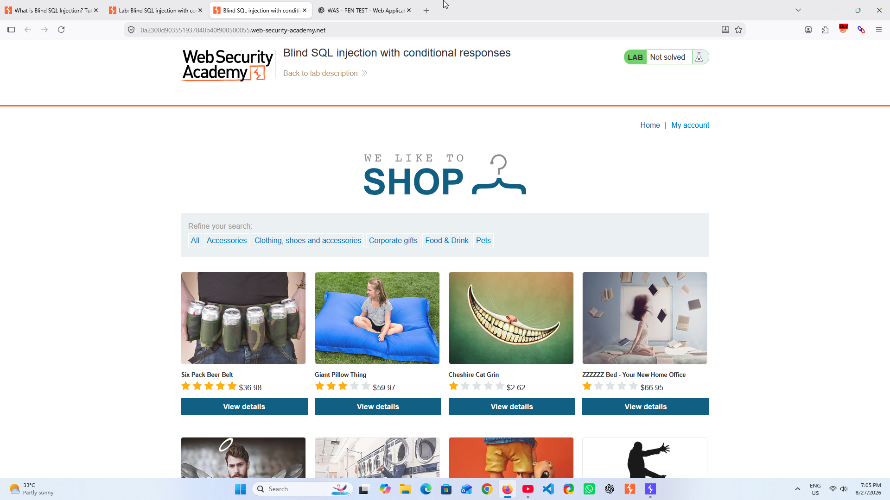
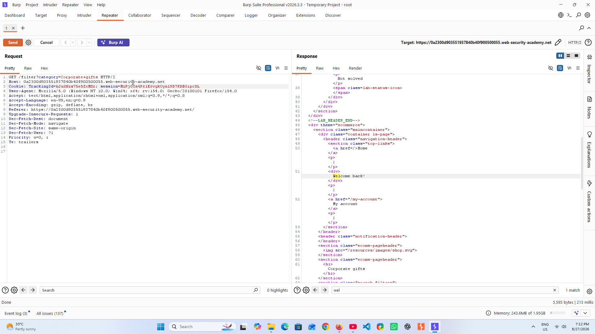
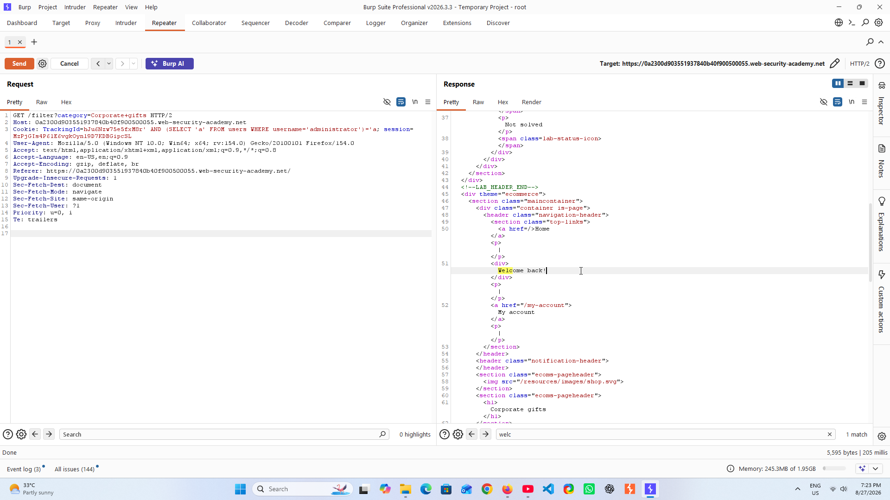
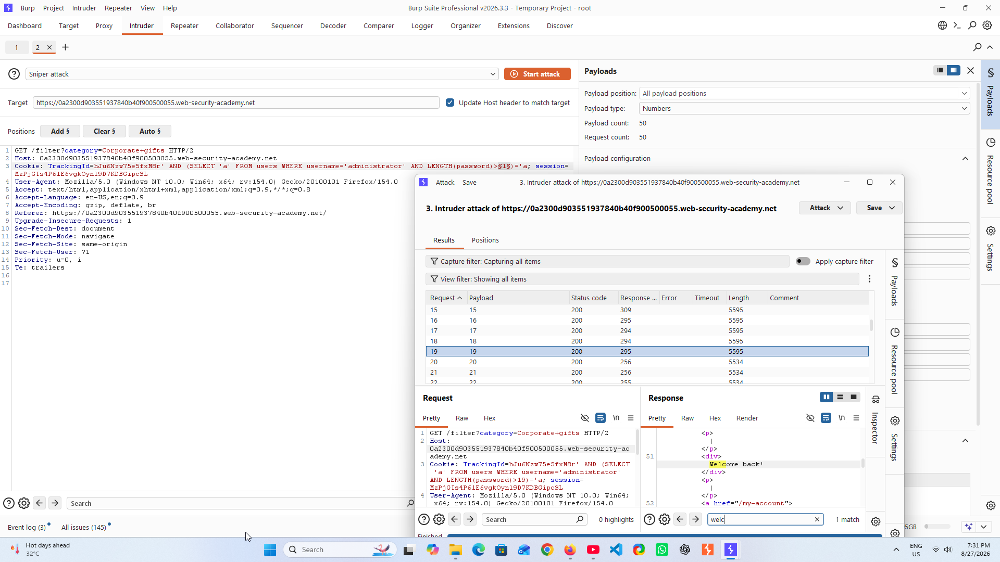
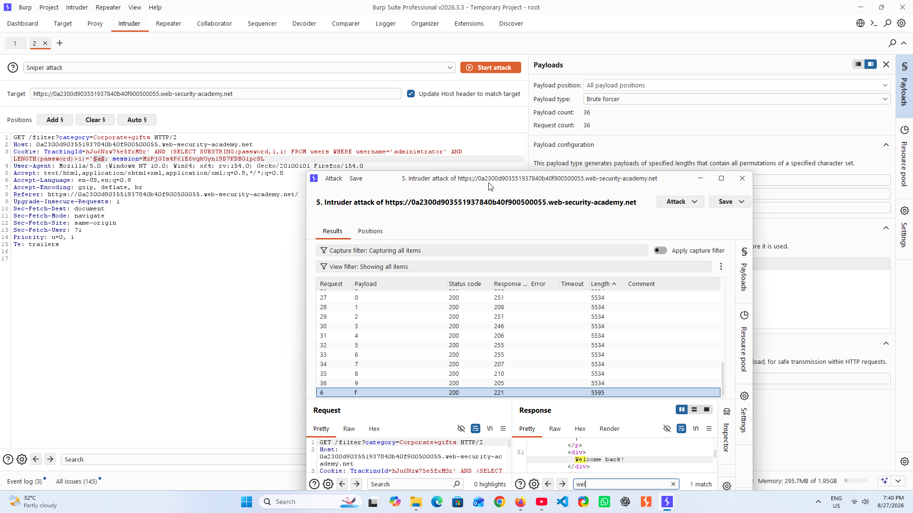
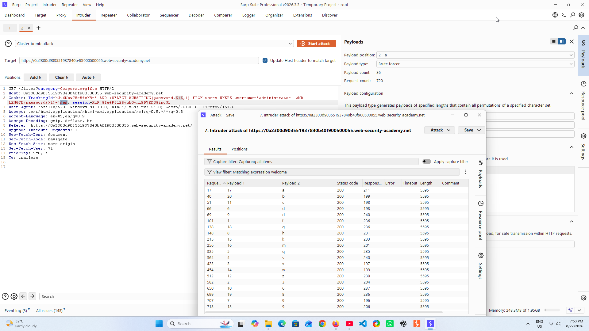
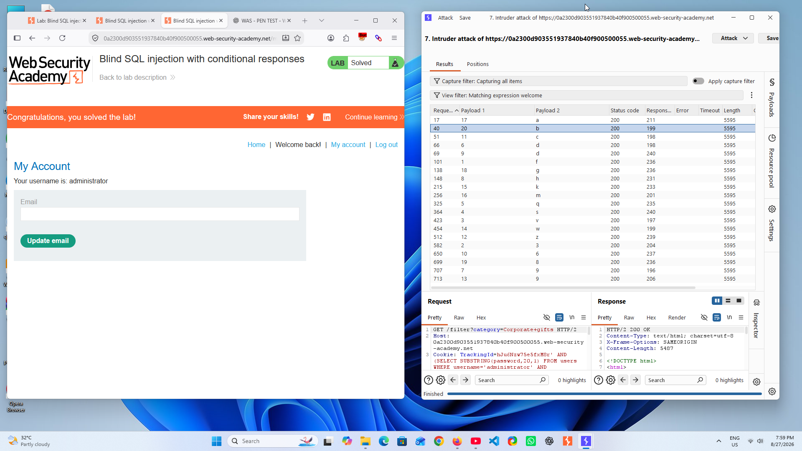

# Blind SQL Injection with Conditional Responses

## Lab Overview

**Platform:** PortSwigger Web Security Academy  
**Vulnerability:** Blind SQL Injection  
**Technique:** Conditional Responses / Boolean Inference  
**Injection Point:** `TrackingId` Cookie  
**Target:** `administrator`

---

## Objective

The objective of this lab was to identify and exploit a Blind SQL Injection vulnerability where database information is not directly returned by the application.

Instead, differences in application responses were used as a **Boolean oracle** to determine whether injected SQL conditions evaluated to TRUE or FALSE.

---

## Methodology

### 1. Lab Environment

The lab was performed in an authorized PortSwigger Web Security Academy environment.



---

### 2. Establishing a Baseline

A normal application request was captured and analyzed first to establish a reliable baseline for subsequent testing.



---

### 3. Identifying the Target Account

The testing process confirmed the presence of the target `administrator` account.



---

### 4. Identifying the Conditional Response

A Boolean condition was introduced through the vulnerable `TrackingId` cookie.

The application's response behavior changed depending on whether the injected condition evaluated to TRUE or FALSE.

This provided a reliable **Boolean oracle** for the subsequent inference process.



---

### 5. Password Character Discovery

After establishing the Boolean response indicator, password characteristics were inferred through repeated conditional testing.

Burp Suite Intruder was used to automate repetitive candidate testing.



---

### 6. Password Retrieval

The recovered password was verified as part of the authorized training exercise.

> **Note:** Sensitive credential values should be redacted before publishing screenshots to a public repository.



---

### 7. Lab Verification

The final result was verified by successfully completing the PortSwigger Web Security Academy lab.



---

# Technical Analysis

## What is Blind SQL Injection?

Blind SQL Injection occurs when an application is vulnerable to SQL Injection but does not directly display the database query results.

Instead, information can be inferred from observable application behavior.

```text
Injected SQL Condition
        ↓
Database Evaluation
        ↓
TRUE / FALSE
        ↓
Observable Application Response
        ↓
Information Inference