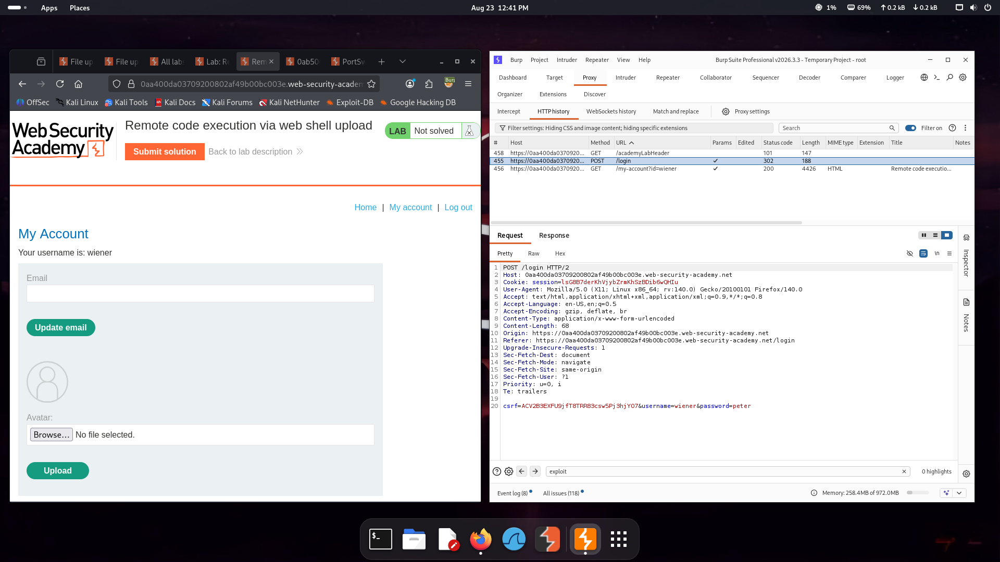

# Remote Code Execution via Web Shell Upload

## Lab Overview

This lab demonstrates a **Remote Code Execution (RCE)** vulnerability caused by an unrestricted file upload mechanism.

The application allows an authenticated user to upload an avatar image. However, the upload functionality fails to properly validate the uploaded file type and permits a server-side executable file to be uploaded.

Because the uploaded file is stored inside a web-accessible directory and interpreted by the server, an attacker can achieve server-side code execution.

> **Environment:** PortSwigger Web Security Academy  
> **Vulnerability:** Unrestricted File Upload  
> **Impact:** Remote Code Execution  
> **Severity:** Critical  
> **Testing Type:** Authorized Security Lab

---

## Objective

The objective of this lab was to demonstrate how an insecure file upload functionality can be abused to achieve remote code execution.

The testing workflow consisted of:

1. Authenticating to the lab application.
2. Identifying the avatar upload functionality.
3. Preparing a server-side PHP payload.
4. Intercepting the upload request using Burp Suite.
5. Uploading the PHP file through the vulnerable functionality.
6. Accessing the uploaded file through its web-accessible path.
7. Verifying server-side code execution.
8. Confirming successful lab completion.

---

## Methodology

### 1. Authentication

First, I authenticated to the lab application using the provided test credentials.

**Evidence:**



---

### 2. Payload Preparation

A PHP payload was created to demonstrate server-side code execution.

The payload is stored in:

```text
payloads/exploit.php