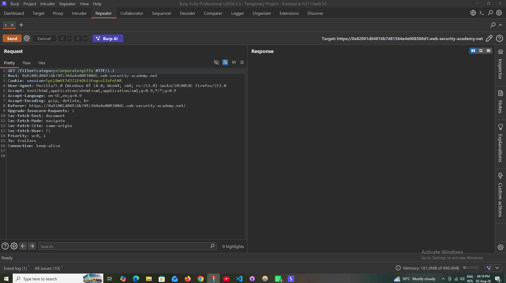
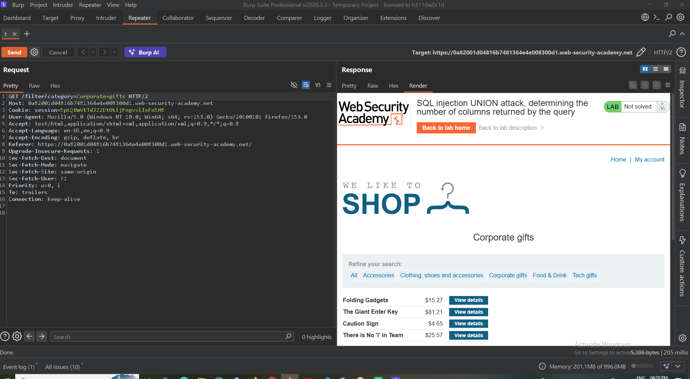
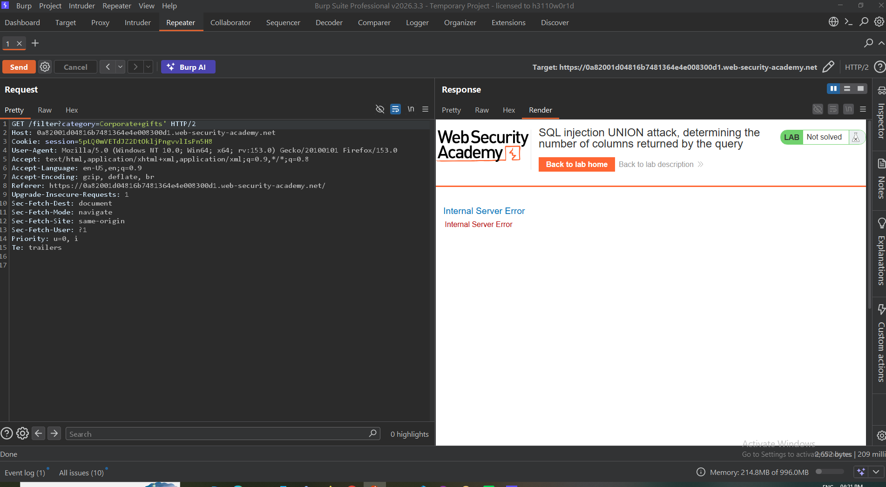
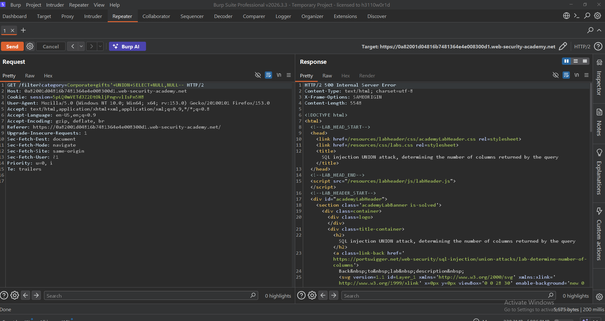
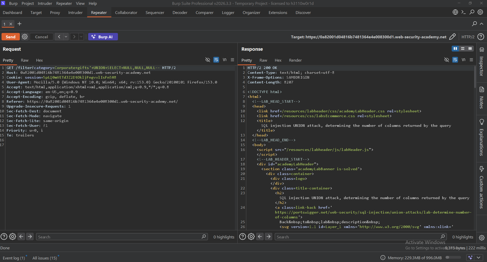

# SQL Injection Authentication Bypass

> **PortSwigger Web Security Academy** lab demonstrating how a SQL Injection vulnerability in a login form can allow authentication to be bypassed.

---

## Lab Information

| Field | Value |
|-------|-------|
| Platform | PortSwigger Web Security Academy |
| Category | SQL Injection |
| Technique | Authentication Bypass |
| Difficulty | Apprentice |
| Status | ✅ Solved |

---

## Overview

Authentication mechanisms should securely validate user credentials before granting access. When user input is directly incorporated into SQL queries, attackers may manipulate the query logic to bypass authentication and gain unauthorized access.

This lab demonstrates how SQL Injection can be used to log in as the administrator without knowing the correct password.

---

## Objective

- Identify SQL Injection in the login form
- Intercept and modify authentication requests
- Craft an authentication bypass payload
- Log in as the administrator
- Document the complete exploitation process

---

## Tools Used

- Burp Suite Professional
- Burp Repeater
- Firefox
- PortSwigger Web Security Academy

---

# Methodology

## Step 1 — Capture the Login Request

Intercept the login request using Burp Suite Proxy.

**Screenshot**


---

## Step 2 — Review the Original Request

Forward the captured request to Burp Repeater and review the original HTTP request.

**Screenshot**



---

## Step 3 — Observe the Original Response

Send the request without modification and observe the normal server response.

**Screenshot**



---

## Step 4 — Prepare the Request

Prepare the intercepted request for SQL Injection testing in Burp Repeater.

**Screenshot**


---

## Step 5 — Test an Invalid Payload

Inject an invalid payload to verify that the application is vulnerable to SQL Injection.

Example:

```sql
'
```

Result:

- HTTP 500 Internal Server Error
- Indicates the input is processed by the SQL query.

**Screenshot**


---

## Step 6 — Confirm the SQL Error

The server returns an SQL error, confirming that the login functionality is vulnerable.

**Screenshot**



---

## Step 7 — Perform Authentication Bypass

Inject a payload to terminate the SQL statement and comment out the password verification.

Payload:

```sql
administrator'--
```

The application ignores the password check and authenticates as the administrator.

**Screenshot**



---

## Step 8 — Verify Successful Authentication

The application successfully authenticates the administrator account.

**Screenshot**



---

## Step 9 — Lab Solved

Authentication is successfully bypassed and the lab is completed.

**Screenshot**


---

# Payload Used

```sql
administrator'--
```

---

# Key Learning

- Login forms are common targets for SQL Injection attacks.
- Unsanitized user input can completely bypass authentication.
- SQL comments (`--`) can remove password verification from the query.
- Prepared statements effectively prevent this type of vulnerability.
- Secure authentication depends on proper input handling and parameterized SQL queries.

---

# Mitigation

- Use parameterized queries (Prepared Statements).
- Never concatenate user input into SQL statements.
- Validate and sanitize user input.
- Suppress detailed SQL error messages.
- Apply least-privilege database permissions.
- Monitor authentication logs for suspicious login attempts.

---

# Skills Practiced

- SQL Injection
- Authentication Bypass
- Burp Suite Proxy
- Burp Repeater
- HTTP Request Analysis
- Manual Web Application Testing

---

# References

- PortSwigger Web Security Academy
- OWASP Web Security Testing Guide (WSTG)
- OWASP SQL Injection Prevention Cheat Sheet
- CWE-89: SQL Injection

---

# Disclaimer

This write-up documents an authorized laboratory exercise completed within the PortSwigger Web Security Academy. All testing was performed exclusively in a controlled environment for educational purposes.