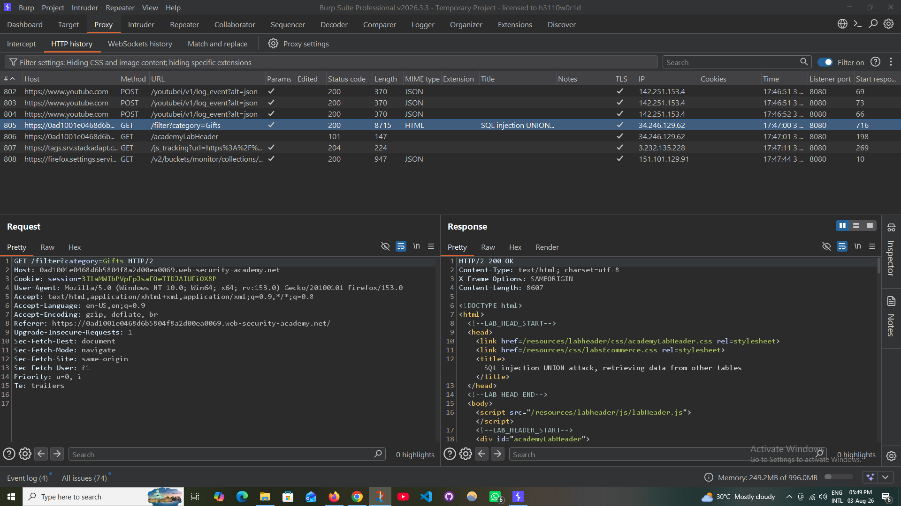
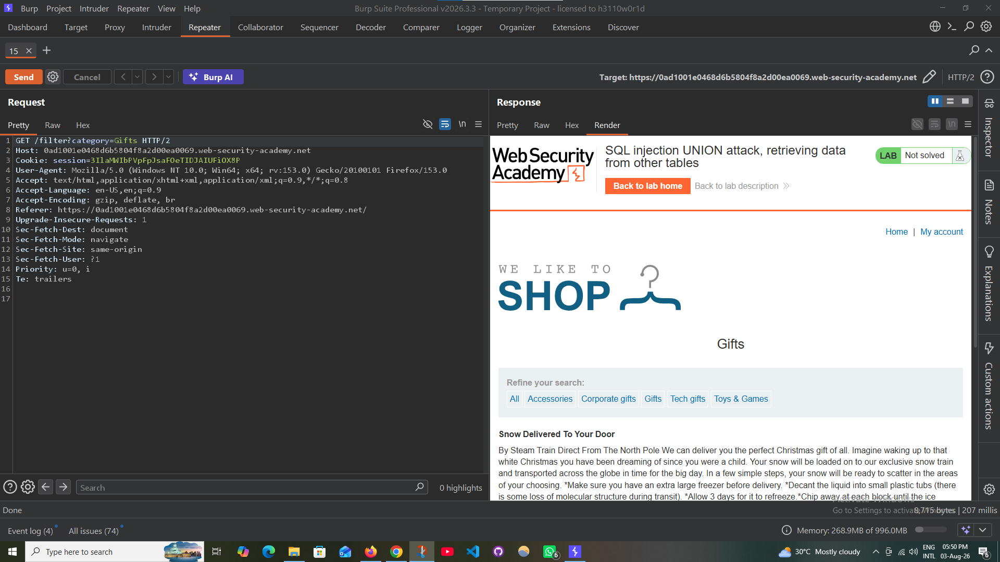
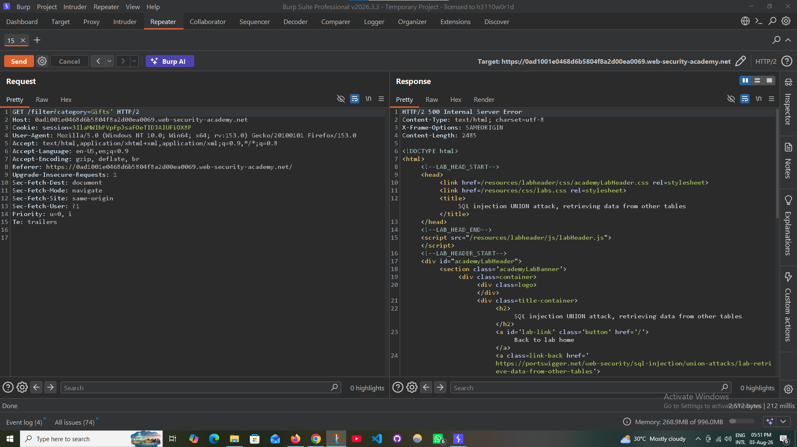
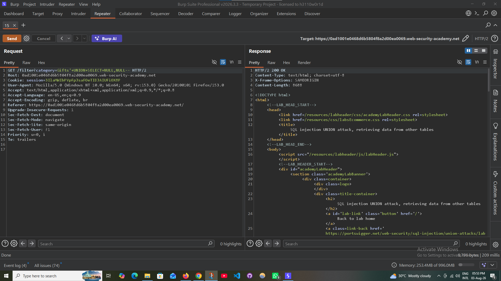
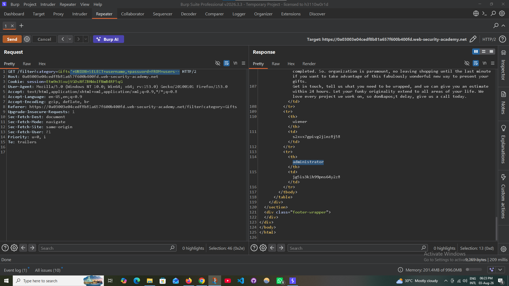

# SQL Injection UNION Attack – Retrieving Data from Other Tables

> **PortSwigger Web Security Academy** lab demonstrating how a UNION-based SQL Injection can be used to enumerate database objects and retrieve sensitive information from another table.

---

## Lab Information

| Field | Value |
|-------|-------|
| Platform | PortSwigger Web Security Academy |
| Category | SQL Injection |
| Technique | UNION-Based SQL Injection |
| Lab | Retrieving Data from Other Tables |
| Difficulty | Apprentice |
| Status | ✅ Solved |

---

## Overview

Once the correct number of columns and compatible data types have been identified, a UNION-based SQL Injection can be used to query other database tables.

In this lab, the vulnerable application exposes data from the hidden `users` table, allowing administrator credentials to be retrieved.

---

## Objective

- Identify UNION-compatible columns
- Enumerate database tables
- Identify sensitive columns
- Retrieve administrator credentials
- Authenticate as the administrator
- Complete the lab

---

## Tools Used

- Burp Suite Professional
- Burp Repeater
- Firefox
- PortSwigger Web Security Academy

---

## Methodology

### Step 1 — Intercept the Request

Capture the vulnerable request using Burp Suite Proxy.

**Screenshot**

---

### Step 2 — Determine the Number of Columns

Identify the correct number of columns returned by the original SQL query.

**Screenshot**

---

### Step 3 — Verify UNION Compatibility

Verify that the UNION query executes successfully using the correct number of columns.

**Screenshot**

---

### Step 4 — Identify the Users Table

Enumerate the database tables and locate the `users` table.

**Screenshot**

---

### Step 5 — Identify Username and Password Columns

Enumerate the columns within the `users` table to identify sensitive fields.

**Screenshot**

---

### Step 6 — Retrieve Administrator Credentials

Extract usernames and passwords from the `users` table using a UNION SELECT statement.

**Screenshot**

---

### Step 7 — Login as Administrator

Authenticate successfully using the retrieved administrator credentials.

**Screenshot**

---

### Step 8 — Verify Lab Completion

The application confirms that the lab has been solved successfully.

**Screenshot**

---

## Payloads

See:

**payloads.txt**

---

## Key Learning

- UNION-based SQL Injection can retrieve data from arbitrary database tables.
- Successful exploitation requires matching the original query's column count and data types.
- Database enumeration is a critical step before extracting sensitive information.
- Exposed credentials can lead to complete account compromise.
- Parameterized queries effectively prevent SQL Injection attacks.

---

## Mitigation

- Use parameterized queries (Prepared Statements).
- Never concatenate user input into SQL statements.
- Validate and sanitize user input.
- Restrict database account privileges.
- Suppress detailed SQL error messages.
- Conduct regular application security testing.

---

## Skills Practiced

- SQL Injection
- UNION-Based SQL Injection
- Database Enumeration
- Table Enumeration
- Column Enumeration
- Credential Extraction
- Burp Suite Repeater
- HTTP Request Analysis
- Manual Web Application Testing

---

## References

- PortSwigger Web Security Academy
- OWASP Web Security Testing Guide (WSTG)
- OWASP SQL Injection Prevention Cheat Sheet
- CWE-89: SQL Injection

---

## Disclaimer

This write-up documents an authorized laboratory exercise completed within the PortSwigger Web Security Academy. All testing was performed exclusively in a controlled environment for educational purposes.