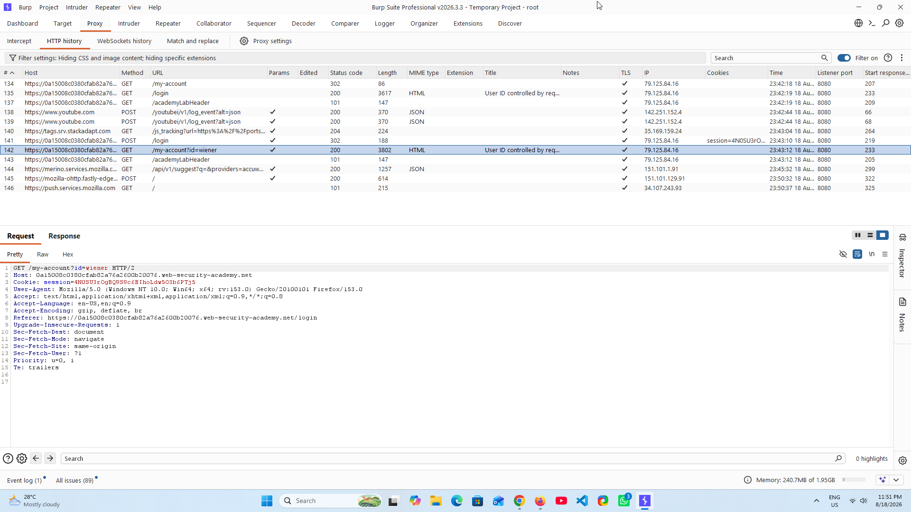
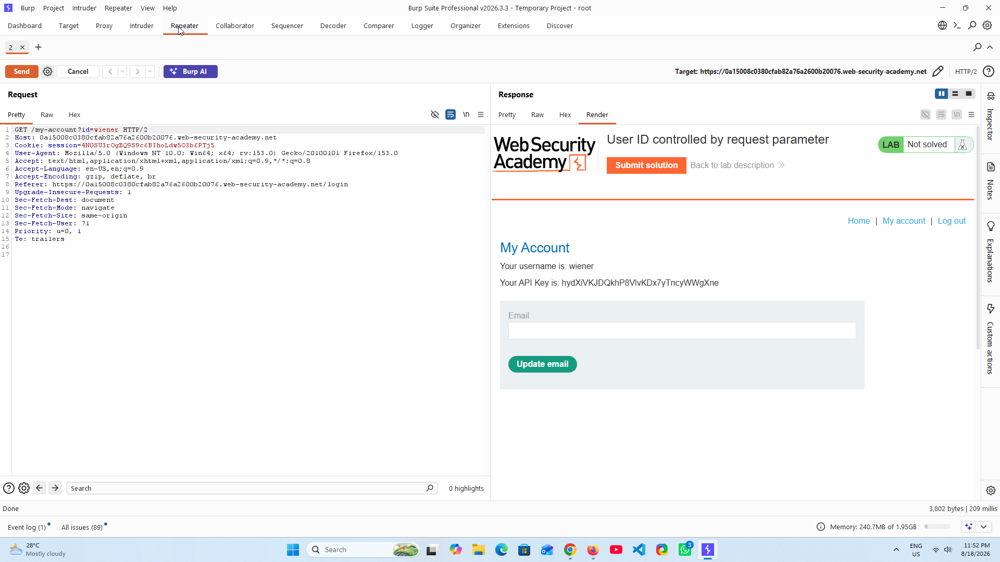
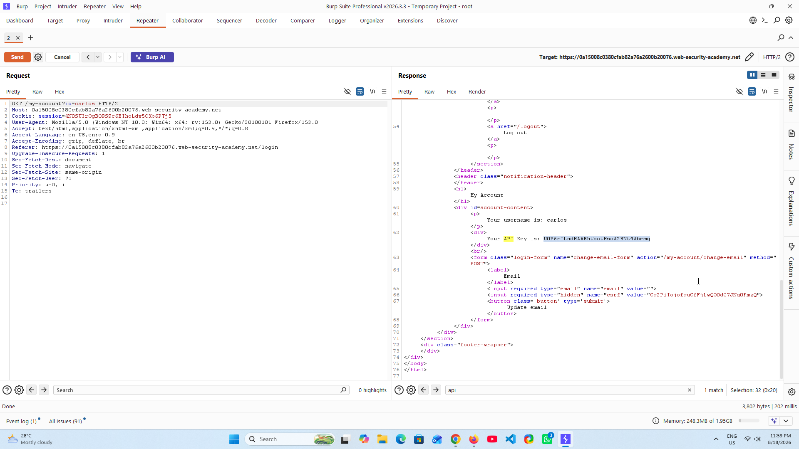
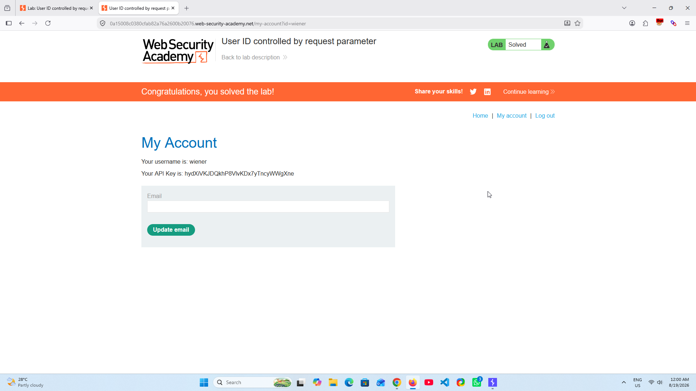

# 🔐 IDOR — User ID Controlled by Request Parameter

### PortSwigger Web Security Academy · A01 — Broken Access Control

---

## 📌 Overview

This lab demonstrates an **Insecure Direct Object Reference (IDOR)** vulnerability caused by insufficient server-side authorization controls.

The application uses a client-controlled `id` request parameter to determine which user's account information is returned.

Although the application correctly authenticates the user, it fails to properly verify whether the authenticated user is authorized to access the requested account object.

By modifying the `id` parameter while maintaining the same authenticated session, another user's account information can be accessed.

This is a classic example of **horizontal privilege escalation** caused by broken object-level authorization.

---

## 🎯 Objective

The objective of this lab is to determine whether an authenticated user can access another user's account information by manipulating a user-controlled object identifier.

The assessment focuses on:

- Identifying the account endpoint
- Identifying the object reference
- Capturing the authenticated request
- Establishing a legitimate baseline
- Manipulating the object identifier
- Maintaining the original authentication context
- Analyzing the server response
- Validating unauthorized object access
- Assessing the security impact
- Identifying the root cause
- Recommending remediation
- Defining a retesting strategy

---

## 🧪 Lab Information

| Field | Details |
|---|---|
| **Platform** | PortSwigger Web Security Academy |
| **Lab** | User ID controlled by request parameter |
| **Vulnerability** | Insecure Direct Object Reference (IDOR) |
| **OWASP Category** | A01 — Broken Access Control |
| **Vulnerability Type** | Broken Object-Level Authorization |
| **Difficulty** | Apprentice |
| **Primary Tool** | Burp Suite Professional |
| **Testing Method** | Manual Request Manipulation |
| **Authentication** | Authenticated Session |
| **Affected Functionality** | User Account |
| **Status** | ✅ Solved |

---

# 🔎 Attack Surface Identification

The vulnerable functionality is the authenticated account endpoint:

```http
GET /my-account?id=wiener HTTP/2
```

The `id` parameter acts as a direct reference to a user account.

Because the value is controlled by the client, it must be treated as untrusted input and properly authorized on the server side.

---

# 🧭 Testing Methodology

The vulnerability was tested using the following methodology:

1. Authenticate using the provided `wiener` account.
2. Navigate to the account page.
3. Capture the request using Burp Suite.
4. Identify the `id` parameter.
5. Establish the legitimate request as a baseline.
6. Send the request to Burp Repeater.
7. Modify the `id` parameter to another user's identifier.
8. Keep the original authentication session unchanged.
9. Analyze the server response.
10. Verify unauthorized access to another user's account information.

---

# 🛠️ Step 1 — Capture the Legitimate Request

After authenticating as the `wiener` user, the account request was captured using **Burp Suite HTTP History**.

The legitimate request contained the following object reference:

```http
GET /my-account?id=wiener HTTP/2
```

### 📸 Evidence — Burp Suite HTTP History

<p align="center">
  
</p>

The captured request establishes the legitimate baseline for the authenticated user.

---

# 🛠️ Step 2 — Send Request to Burp Repeater

The authenticated request was sent to **Burp Suite Repeater** for controlled request manipulation.

The original request was:

```http
GET /my-account?id=wiener HTTP/2
```

### 📸 Evidence — Burp Suite Repeater

<p align="center">
  
</p>

The `id` parameter was identified as the user-controlled object reference.

---

# 🛠️ Step 3 — Manipulate the Object Identifier

The `id` parameter was modified from:

```text
wiener
```

to:

```text
carlos
```

The authentication context was not changed.

The modified request was:

```http
GET /my-account?id=carlos HTTP/2
```

This tests whether the application performs server-side authorization checks before returning the requested account object.

---

# 🔎 Step 4 — Analyze the Server Response

The modified request returned information belonging to the `carlos` account.

The response exposed sensitive account information, including the user's API key.

### 📸 Evidence — Unauthorized Carlos Response

<p align="center">
  
</p>

The successful response confirms that the application accepted a user-controlled object identifier without properly verifying whether the authenticated user was authorized to access that object.

---

# ✅ Step 5 — Lab Completion

The unauthorized access was successfully validated and the PortSwigger lab was completed.

### 📸 Evidence — Lab Solved

<p align="center">
  
</p>

---

# 🧠 Vulnerability Analysis

## Root Cause

The root cause is **insufficient server-side authorization enforcement**.

The application trusts the client-controlled `id` parameter to identify the requested account but does not verify that the currently authenticated user has permission to access that account.

Conceptually:

```text
Authenticated User
        |
        v
GET /my-account?id=carlos
        |
        v
Application retrieves Carlos's account
        |
        v
Authorization check missing
        |
        v
Sensitive information returned
```

A secure implementation must perform an authorization check before returning the requested object.

---

# ⚠️ Security Impact

An authenticated attacker may be able to modify the object identifier and access another user's account information.

Potential impact includes:

- Unauthorized access to other users' data
- Sensitive information disclosure
- Exposure of API keys or credentials
- Horizontal privilege escalation
- Broken object-level authorization
- Potential account compromise depending on exposed information

The actual severity depends on the sensitivity of the affected object and the privileges associated with the exposed information.

---

# 🧪 Proof of Concept

### Legitimate Request

```http
GET /my-account?id=wiener HTTP/2
```

### Modified Request

```http
GET /my-account?id=carlos HTTP/2
```

### Result

The server returned the `carlos` user's account information while the attacker remained authenticated as `wiener`.

This demonstrates unauthorized horizontal access to another user's object.

---

# 🛡️ Remediation

The application should enforce **server-side object-level authorization** for every request involving user-controlled object identifiers.

## 1. Enforce Object Ownership Checks

The application should verify that the authenticated user is authorized to access the requested object.

```text
Authenticated User
        |
        v
Requested Object
        |
        v
Authorization Check
        |
   +----+----+
   |         |
Authorized  Unauthorized
   |         |
   v         v
 Allow      Deny
```

## 2. Never Trust Client-Controlled Identifiers

Parameters such as:

```text
?id=wiener
?id=carlos
?user_id=123
?account_id=456
```

must not be treated as proof of authorization.

## 3. Apply Authorization Consistently

Authorization checks should be enforced across all object-accessing endpoints, including:

- GET
- POST
- PUT
- PATCH
- DELETE

## 4. Return an Appropriate Error

Unauthorized access should be rejected with an appropriate response, such as:

```http
HTTP/2 403 Forbidden
```

The application should also avoid unnecessarily revealing whether another user's account exists.

## 5. Use Indirect References Where Appropriate

Randomized or opaque identifiers can make object enumeration harder, but they **must not replace proper authorization controls**.

---

# 🔄 Retesting Strategy

After remediation, perform the following tests:

1. Authenticate as User A.
2. Access User A's own account.
3. Capture the legitimate request.
4. Modify the object identifier to User B.
5. Replay the request using the same authenticated session.
6. Confirm that User B's information is not returned.
7. Verify that unauthorized access is denied.
8. Test multiple object identifiers.
9. Test related endpoints and HTTP methods.
10. Confirm that authorization remains consistently enforced.

### Expected Secure Behavior

```text
User A + User A Object → ✅ Allowed

User A + User B Object → ❌ Access Denied
```

---

# 📊 Security Assessment

| Category | Result |
|---|---|
| Authentication Required | Yes |
| User-Controlled Object Reference | Yes |
| Server-Side Authorization Check | ❌ Insufficient |
| Horizontal Privilege Escalation | ✅ Confirmed |
| Unauthorized Object Access | ✅ Confirmed |
| Sensitive Information Disclosure | ✅ Confirmed |
| API Key Exposure | ✅ Confirmed |
| Exploitation Complexity | Low |
| Lab Status | ✅ Solved |

---

# 📚 References

- PortSwigger Web Security Academy — Access Control
- OWASP — Broken Access Control
- OWASP — API1: Broken Object Level Authorization
- CWE-639 — Authorization Bypass Through User-Controlled Key

---

# 🏁 Conclusion

This lab demonstrates how insufficient object-level authorization can allow an authenticated attacker to access another user's resources by modifying a client-controlled object identifier.

The vulnerability is not caused by authentication failure. The application successfully authenticates the user but fails to enforce **authorization at the object level**.

The key security principle demonstrated by this lab is:

> **Authentication determines who you are; authorization determines what you are allowed to access.**

Every user-controlled object reference must therefore be validated against the permissions of the currently authenticated user.