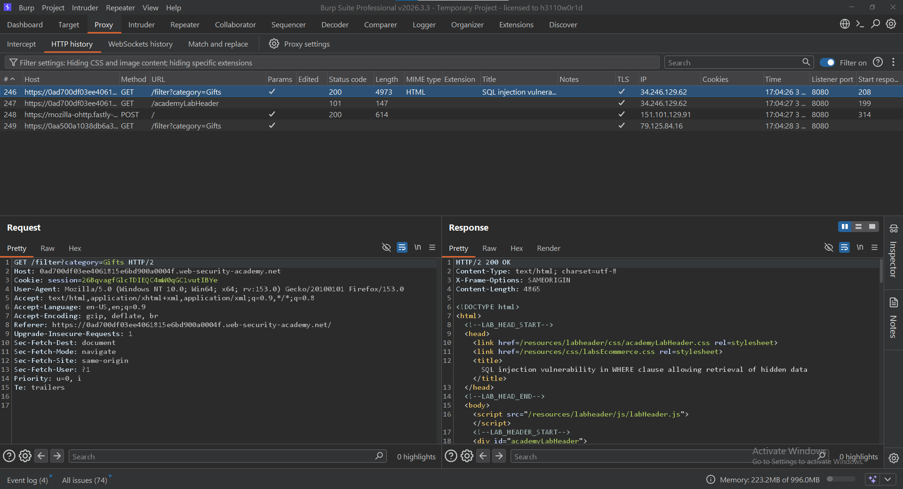
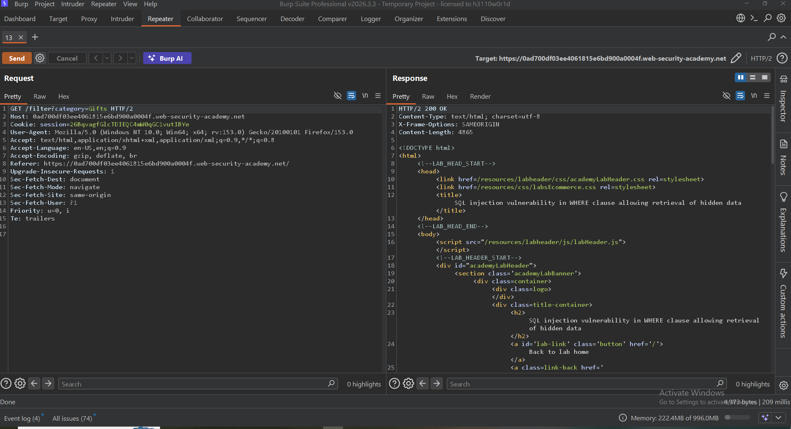
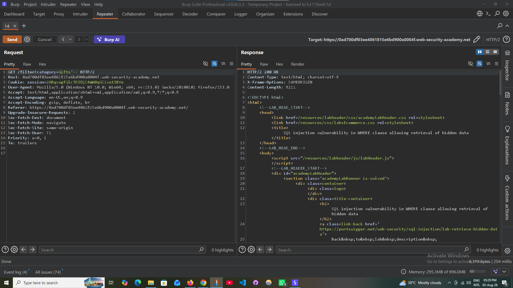
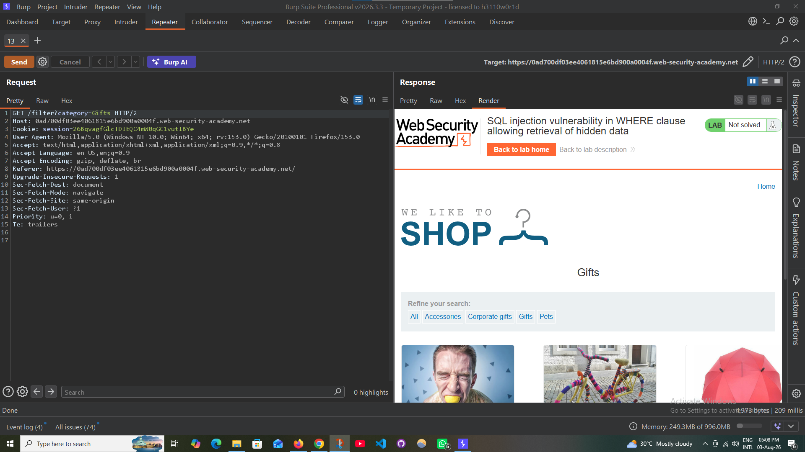
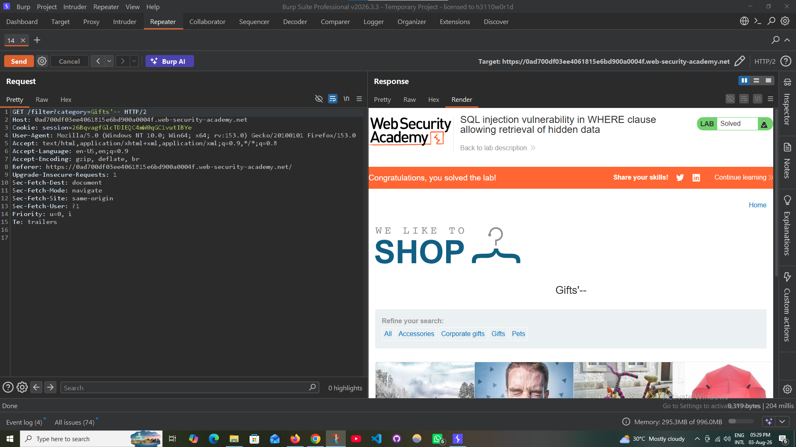

# 💉 SQL Injection — Hidden Data Retrieval

### PortSwigger Web Security Academy · A05 — Injection

---

## 🧪 Lab Information

| Item | Value |
|---|---|
| **Platform** | PortSwigger Web Security Academy |
| **Category** | SQL Injection |
| **Topic** | Hidden Data Retrieval |
| **Difficulty** | Apprentice |
| **Parameter** | `category` |
| **Status** | ✅ Solved |

---

## 🎯 Objective

Exploit a **SQL Injection** vulnerability in the `category` parameter to bypass the application's filtering logic and retrieve products that are not normally displayed.

---

## 🔎 Vulnerability

The application uses a SQL query similar to:

```sql
SELECT * FROM products
WHERE category = 'Gifts'
AND released = 1;
```

The `category` parameter is incorporated into the SQL query without adequate protection, allowing SQL Injection.

**Vulnerability Type:** SQL Injection  
**Location:** `WHERE` clause  
**Affected Parameter:** `category`

---

## 🛠️ Exploitation

### Step 1 — Capture the Request

The request was captured using **Burp Suite Proxy / HTTP History**.

<p align="center">
  
</p>

---

### Step 2 — Send Request to Repeater

The captured request was sent to **Burp Suite Repeater** for controlled testing.

<p align="center">
  
</p>

---

### Step 3 — Inject the Payload

The following SQL Injection payload was appended to the `category` parameter:

```sql
'--
```

Resulting request:

```http
GET /filter?category=Gifts'-- HTTP/2
```

<p align="center">
  
</p>

The `--` sequence comments out the remainder of the SQL statement, effectively removing the original filtering condition.

---

### Step 4 — Observe the Result

The modified request caused the application to return products that were previously hidden by the `released = 1` condition.

<p align="center">
  
</p>

This confirms successful SQL Injection and filter bypass.

---

## ⚠️ Impact

Successful exploitation may allow an attacker to:

- Bypass application filtering
- Retrieve hidden or restricted data
- Manipulate database queries
- Potentially access sensitive database information

The overall impact depends on the application's database privileges and the SQL injection context.

---

## 🛡️ Mitigation

Recommended defenses include:

- Use **parameterized queries / prepared statements**
- Avoid dynamically constructing SQL queries from user input
- Apply appropriate input validation
- Use a least-privileged database account
- Implement secure database access layers
- Perform security testing for SQL Injection during development

---

## 🏁 Result

The SQL Injection vulnerability was successfully exploited to bypass the application's filtering mechanism and retrieve hidden products.

<p align="center">
  
</p>

**Status:** ✅ Successfully Solved

---

## 🧠 Skills Demonstrated

- SQL Injection Testing
- HTTP Request Analysis
- Burp Suite Proxy
- Burp Suite Repeater
- SQL Query Manipulation
- Input Validation Analysis
- Web Application Security Testing