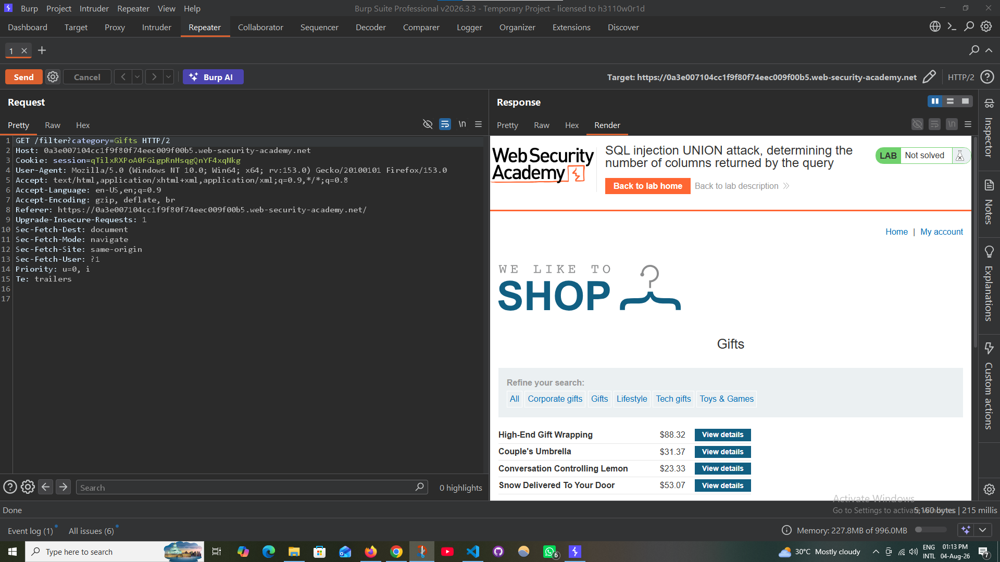
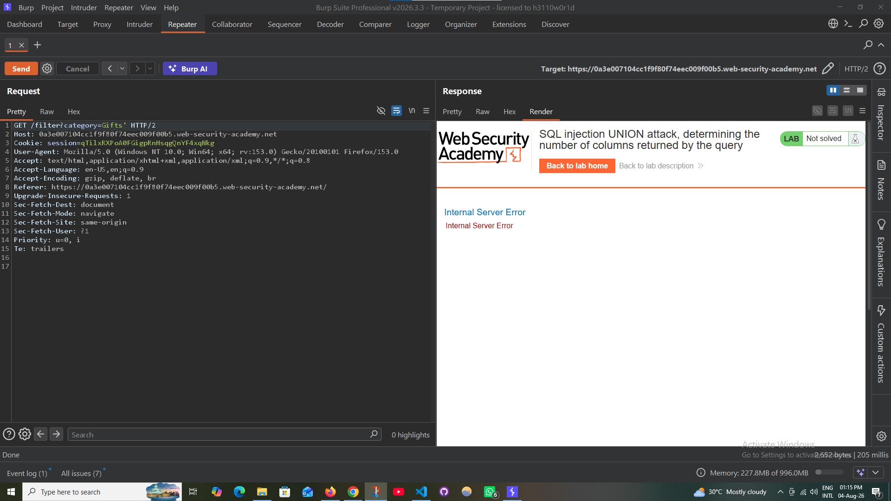
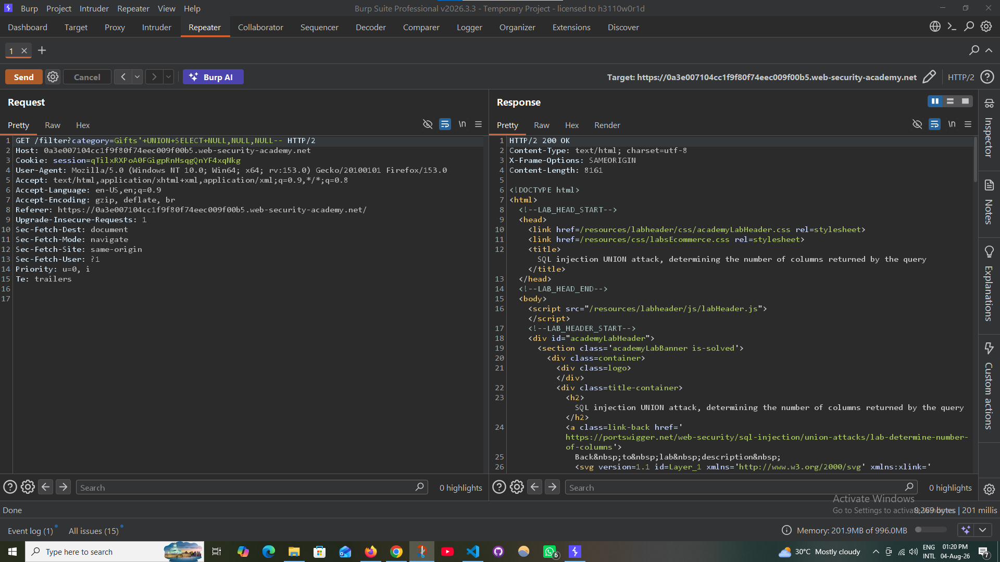

# 💉 SQL Injection — Determine Number of Columns

### PortSwigger Web Security Academy · A05 — Injection

---

## 🧪 Lab Information

| Field | Value |
|---|---|
| **Platform** | PortSwigger Web Security Academy |
| **Module** | SQL Injection |
| **Lab** | Determine Number of Columns |
| **Difficulty** | Apprentice |
| **Parameter** | `category` |
| **HTTP Method** | GET |
| **Status** | ✅ Solved |

---

## 🎯 Objective

Determine the number of columns returned by the original SQL query using a **UNION SELECT** attack.

---

## 🔎 Vulnerability

The application is vulnerable to **SQL Injection** through the `category` parameter.

The injectable parameter was identified as:

```text
category
```

The objective was to determine the correct number of columns before proceeding with further UNION-based SQL Injection testing.

---

## 🧭 Testing Workflow

1. Capture the request using Burp Suite Proxy.
2. Send the request to Burp Repeater.
3. Test a single quote to identify SQL Injection behavior.
4. Test SQL comment syntax.
5. Test `UNION SELECT` with increasing numbers of `NULL` values.
6. Identify the correct number of columns.
7. Verify the successful response.

---

## 🛠️ Step 1 — Capture the Request

The HTTP request was captured using **Burp Suite Proxy / HTTP History**.

<p align="center">
  
</p>

---

## 🛠️ Step 2 — Send Request to Repeater

The captured request was sent to **Burp Suite Repeater** for controlled SQL Injection testing.

<p align="center">
  
</p>

The original request was reviewed before injecting SQL syntax.

<p align="center">
  
</p>

---

## 🔬 Step 3 — Confirm SQL Injection

A single quote was introduced into the `category` parameter to observe the application's behavior.

The resulting error indicated that user input was being interpreted within the SQL query.

<p align="center">
  
</p>

The application also produced an internal server error when the SQL syntax was malformed.

<p align="center">
  
</p>

---

## 🧪 Step 4 — Test UNION SELECT

The SQL comment syntax was tested to determine whether the remainder of the original query could be neutralized.

<p align="center">
  
</p>

The number of columns was then tested using increasing numbers of `NULL` values:

```sql
' UNION SELECT NULL--
' UNION SELECT NULL,NULL--
' UNION SELECT NULL,NULL,NULL--
```

The two-column UNION attempt failed:

<p align="center">
  
</p>

The three-column UNION attempt was successful:

```sql
' UNION SELECT NULL,NULL,NULL--
```

<p align="center">
  
</p>

---

## ✅ Result

The successful payload confirmed that the original SQL query returns **3 columns**.

```http
HTTP/2 200 OK
```

The PortSwigger lab was successfully completed.

<p align="center">
  
</p>

---

## ⚠️ Impact

Determining the correct number of columns is a fundamental step in a UNION-based SQL Injection attack.

Once the column count is known, an attacker may potentially use UNION queries to retrieve information from the database, depending on the application's SQL context and database privileges.

---

## 🛡️ Mitigation

Recommended defenses include:

- Use **prepared statements / parameterized queries**
- Avoid concatenating user input into SQL statements
- Use secure ORM/database access methods
- Apply appropriate input validation
- Use least-privileged database accounts
- Perform regular SQL Injection security testing

---

## 🧠 Skills Demonstrated

- SQL Injection Testing
- UNION-Based SQL Injection
- Column Count Enumeration
- HTTP Request Analysis
- Burp Suite Proxy
- Burp Suite Repeater
- Manual Web Application Security Testing

---

## 🏁 Status

**✅ Successfully Solved**