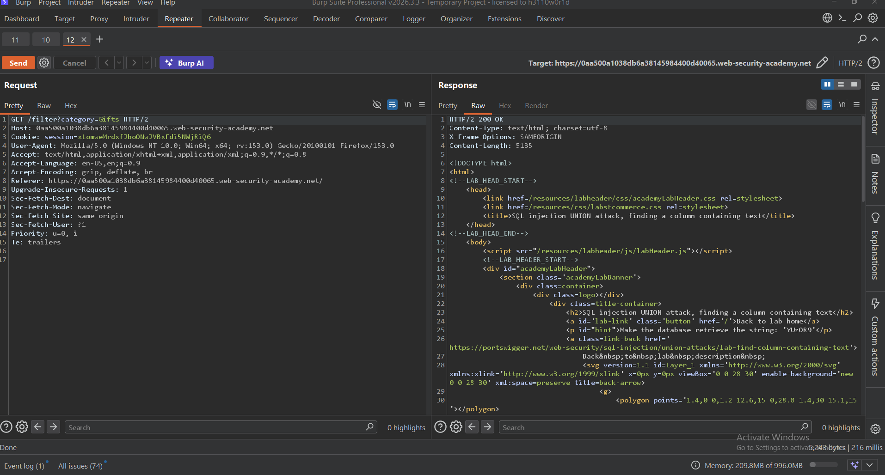
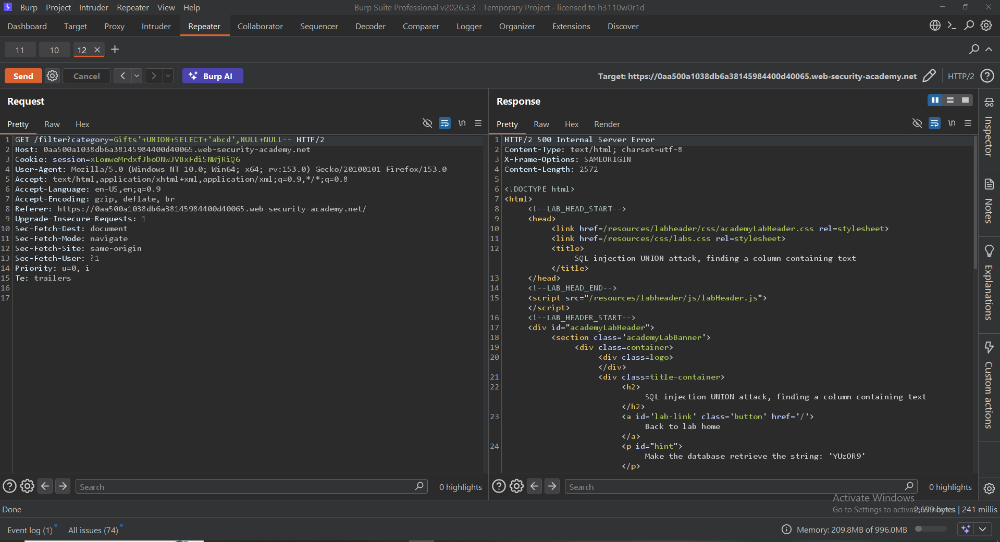
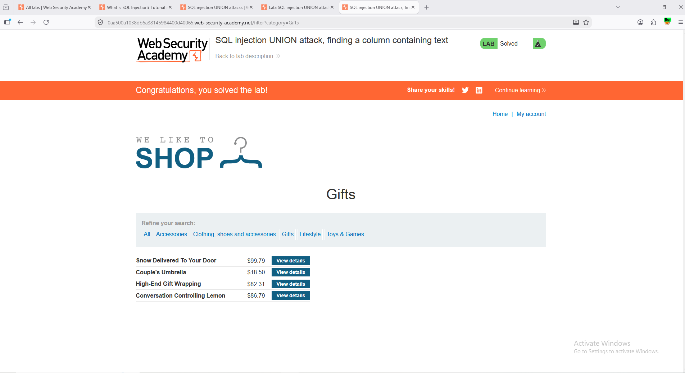

# 💉 SQL Injection — Finding a Column Containing Text

### PortSwigger Web Security Academy · A05 — Injection

---

## 🧪 Lab Information

| Field | Value |
|---|---|
| **Platform** | PortSwigger Web Security Academy |
| **Module** | SQL Injection |
| **Lab** | Finding a Column Containing Text |
| **Difficulty** | Apprentice |
| **Parameter** | `category` |
| **HTTP Method** | GET |
| **Status** | ✅ Solved |

---

## 🎯 Objective

Identify which column in the UNION query accepts **text values** and display the random string provided by the lab.

---

## 🔎 Vulnerability

The application is vulnerable to **SQL Injection** through the `category` parameter.

A previously identified three-column UNION query was used to determine which column accepts string data.

### Lab String

```text
YUz0R9
```

---

## 🧭 Testing Workflow

1. Capture the request using Burp Suite.
2. Identify the injectable `category` parameter.
3. Send the request to Burp Repeater.
4. Use the previously identified three-column UNION query.
5. Test a string value in each column.
6. Identify the text-compatible column.
7. Display the provided random string.
8. Confirm successful exploitation.

---

## 🛠️ Step 1 — Capture the Request

The request was captured using **Burp Suite Proxy / HTTP History**.

<p align="center">
  
</p>

---

## 🔎 Step 2 — Establish the Baseline

The original response was reviewed before performing the UNION-based tests.

<p align="center">
  
</p>

---

## 🧪 Step 3 — Test Column Data Types

A text value was first inserted into the first column:

```sql
' UNION SELECT 'abcd',NULL,NULL--
```

The application returned:

```http
HTTP/2 500 Internal Server Error
```

This indicated that the first column did not accept the supplied text value.

<p align="center">
  
</p>

---

## ✅ Step 4 — Identify the Text-Compatible Column

The text value was then moved to the second column:

```sql
' UNION SELECT NULL,'YUz0R9',NULL--
```

The application accepted the payload and displayed the supplied string.

<p align="center">
  
</p>

The second column was therefore confirmed as text-compatible.

---

## 🎯 Step 5 — Final Payload

The successful payload was:

```sql
' UNION SELECT NULL,'YUz0R9',NULL--
```

The response returned:

```http
HTTP/2 200 OK
```

<p align="center">
  
</p>

---

## ⚠️ Impact

Identifying a text-compatible column enables further UNION-based SQL Injection attacks.

Depending on the application's database and privileges, an attacker may potentially extract:

- Usernames
- Passwords
- Database information
- Application data
- Sensitive records

---

## 🛡️ Mitigation

Recommended defenses include:

- Use **prepared statements / parameterized queries**
- Avoid concatenating user input into SQL queries
- Apply appropriate input validation
- Use secure ORM/database access methods
- Follow the principle of least privilege
- Perform regular SQL Injection testing

---

## 🏁 Result

The second column was confirmed to accept text values, and the lab-provided string `YUz0R9` was successfully displayed.

The PortSwigger lab was successfully completed.

<p align="center">
  
</p>

**Status:** ✅ Successfully Solved

---

## 🧠 Skills Demonstrated

- SQL Injection Testing
- UNION-Based SQL Injection
- Column Data-Type Identification
- Burp Suite Proxy
- Burp Suite Repeater
- HTTP Response Analysis
- Manual Web Application Security Testing