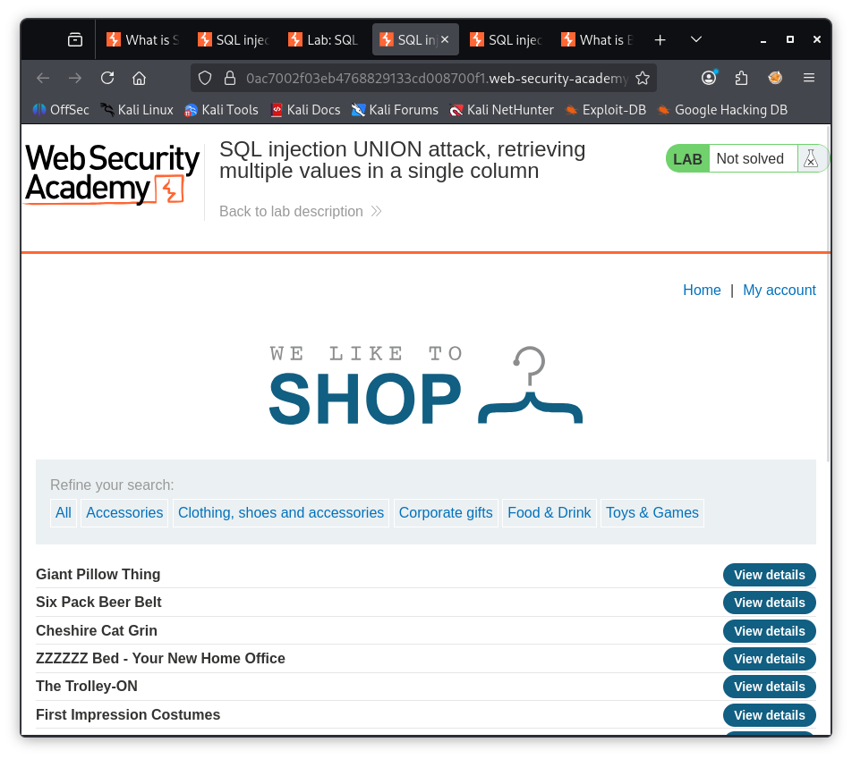
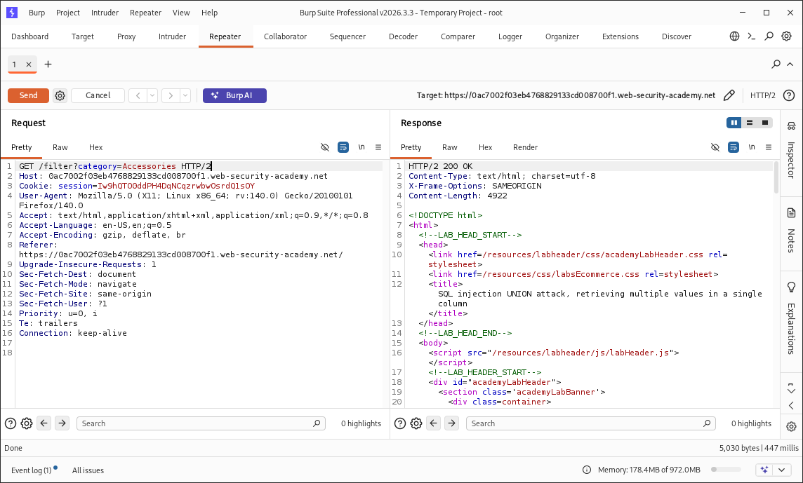
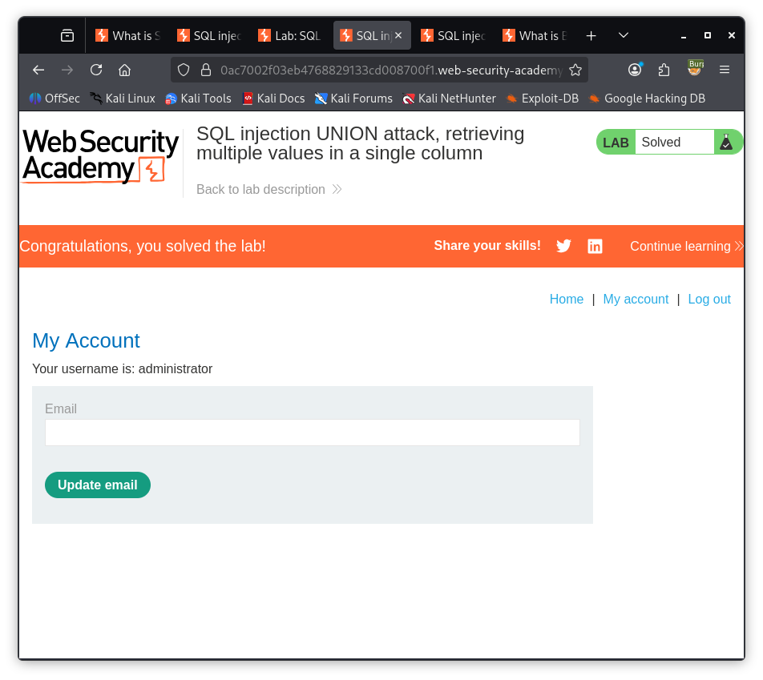

# 💉 SQL Injection — Retrieving Multiple Values in a Single Column

### PortSwigger Web Security Academy · A05 — Injection

---

## 🧪 Lab Information

| Field | Value |
|---|---|
| **Platform** | PortSwigger Web Security Academy |
| **Module** | SQL Injection |
| **Lab** | Retrieving Multiple Values in a Single Column |
| **Difficulty** | Apprentice |
| **Attack Type** | UNION-Based SQL Injection |
| **Parameter** | `category` |
| **Status** | ✅ Solved |

---

## 🎯 Objective

Exploit a **UNION-based SQL Injection** vulnerability to retrieve multiple values through a single text-compatible column and obtain administrator credentials.

---

## 🔎 Vulnerability

The application is vulnerable to SQL Injection through the `category` parameter.

The lab requires retrieving the `username` and `password` values from the `users` table. Since only one output column is suitable for text, both values must be concatenated into a single result.

<p align="center">
  
</p>

---

## 🧭 Attack Workflow

1. Identify the SQL Injection point.
2. Determine the number of columns.
3. Identify the text-compatible column.
4. Identify the `users` table and relevant fields.
5. Concatenate `username` and `password`.
6. Retrieve administrator credentials.
7. Authenticate as the administrator.
8. Verify successful exploitation.

---

## 🛠️ Step 1 — Identify the Injection Point

The vulnerable parameter was identified as:

```text
category
```

Original request:

```http
GET /filter?category=Accessories HTTP/2
```

<p align="center">
  
</p>

---

## 🧪 Step 2 — Determine the Column Count

The UNION attack was tested against the original query.

The application was found to return:

```text
2 columns
```

<p align="center">
  
</p>

---

## 🔎 Step 3 — Identify the Text-Compatible Column

The output columns were tested to determine which one accepted text values.

The second column was identified as the text-compatible output column.

<p align="center">
  
</p>

---

## 💉 Step 4 — Retrieve Multiple Values

The `users` table contained the following relevant fields:

```text
username
password
```

Because only one column was suitable for text output, the two values were concatenated using the SQL string concatenation operator:

```sql
username || '~' || password
```

The resulting UNION query was:

```sql
' UNION SELECT NULL,username||'~'||password FROM users--
```

This allowed multiple username/password pairs to be returned through the single text-compatible column.

<p align="center">
  
</p>

> **Note:** Sensitive credentials should be redacted before publishing this evidence in a public portfolio.

---

## 🔐 Step 5 — Administrator Authentication

The extracted administrator credentials were used to authenticate through the application's login functionality.

The administrator account was successfully accessed.

---

## ⚠️ Impact

Successful exploitation can allow an attacker to:

- Retrieve sensitive database records
- Extract usernames and passwords
- Disclose authentication information
- Compromise privileged accounts
- Gain unauthorized administrative access

The impact depends on the application's database privileges and the sensitivity of the exposed data.

---

## 🛡️ Mitigation

Recommended defenses include:

- Use **parameterized queries / prepared statements**
- Never concatenate untrusted input into SQL statements
- Apply appropriate server-side input validation
- Use least-privileged database accounts
- Avoid exposing detailed database errors
- Store passwords using strong password hashing
- Perform regular SQL Injection security testing

---

## 🏁 Result

The `username` and `password` values were successfully retrieved through a single text-compatible UNION output column.

The administrator credentials were used to authenticate successfully, completing the lab.

<p align="center">
  
</p>

**Status:** ✅ Successfully Solved

---

## 🧠 Skills Demonstrated

- UNION-Based SQL Injection
- Column Enumeration
- Data-Type Identification
- String Concatenation
- Database Data Extraction
- Credential Disclosure
- Burp Suite Repeater
- Manual Web Application Security Testing