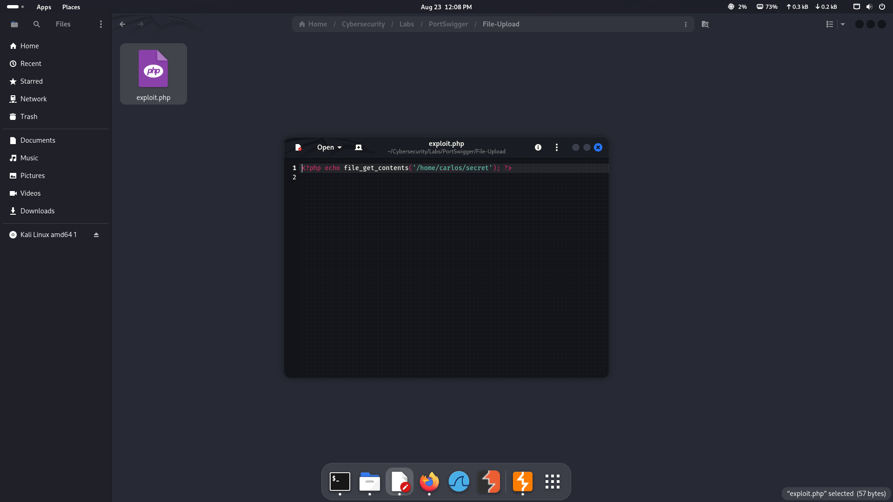
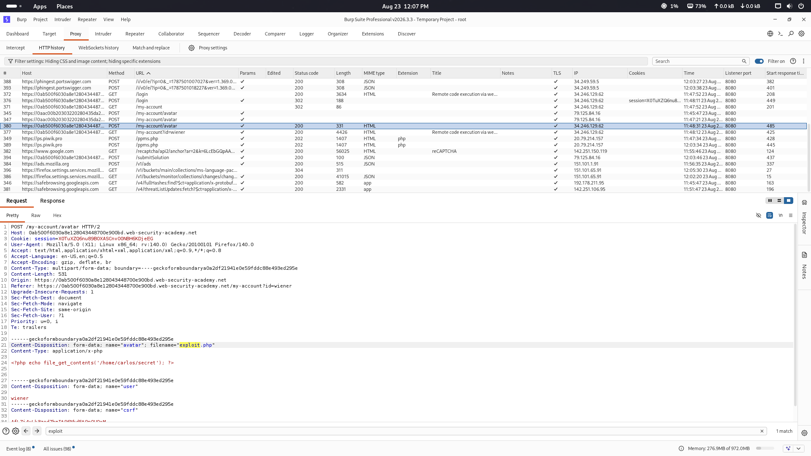
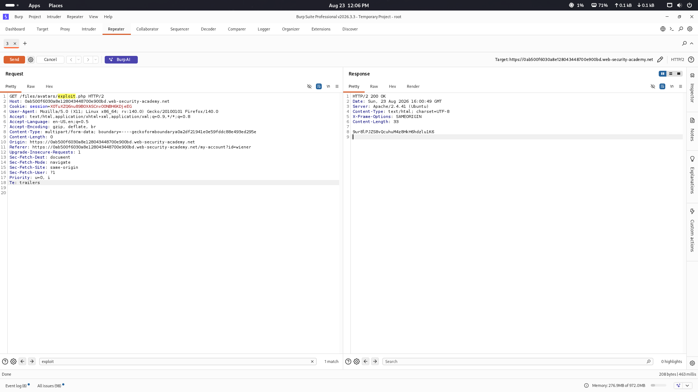
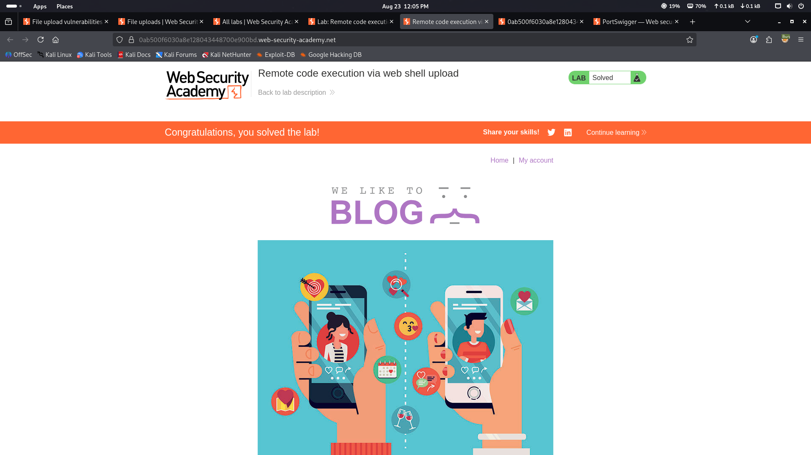

# 💻 Remote Code Execution via Web Shell Upload

### PortSwigger Web Security Academy · A05 — Injection

---

## 🧪 Lab Information

| Field | Value |
|---|---|
| **Platform** | PortSwigger Web Security Academy |
| **Vulnerability** | Unrestricted File Upload |
| **Impact** | Remote Code Execution (RCE) |
| **Severity** | Critical |
| **Testing Type** | Authorized Security Lab |
| **Status** | ✅ Solved |

---

## 🎯 Objective

Demonstrate how an insecure file upload functionality can be abused to upload a server-side executable file and achieve **Remote Code Execution (RCE)**.

---

## 🔎 Vulnerability

The application provides an avatar upload functionality but fails to properly validate the uploaded file.

An attacker can upload a server-side executable file instead of a legitimate image. If the uploaded file is stored in a web-accessible location and interpreted by the server, arbitrary server-side code execution may become possible.

---

## 🧭 Attack Workflow

1. Authenticate to the application.
2. Identify the avatar upload functionality.
3. Prepare a PHP web-shell payload.
4. Intercept the upload request using Burp Suite.
5. Upload the crafted file.
6. Verify successful file upload.
7. Access the uploaded file through its web-accessible location.
8. Confirm server-side code execution.
9. Verify lab completion.

---

## 🔐 Step 1 — Authentication

The lab application was accessed using the provided test credentials.

<p align="center">
  
</p>

---

## 💻 Step 2 — Prepare the PHP Payload

A PHP payload was prepared for the authorized lab environment to demonstrate server-side code execution.

```text
payloads/exploit.php
```

<p align="center">
  
</p>

---

## 📤 Step 3 — Upload the File

The crafted file was uploaded through the application's avatar upload functionality.

The upload was accepted by the application.

<p align="center">
  
</p>

---

## 🕵️ Step 4 — Analyze the Upload Request

The upload request was intercepted and reviewed using **Burp Suite**.

<p align="center">
  
</p>

The request demonstrated that the application accepted the uploaded server-side executable file without sufficient validation.

---

## 💥 Step 5 — Verify Remote Code Execution

The uploaded file was accessed through the application's web-accessible path.

Successful server-side execution confirmed the **Remote Code Execution** impact.

---

## ⚠️ Impact

An unrestricted server-side file upload vulnerability may allow an attacker to:

- Upload executable files
- Execute arbitrary server-side code
- Access application resources
- Modify application data
- Potentially compromise the underlying server

The actual impact depends on server configuration, file permissions, execution context, and application privileges.

---

## 🛡️ Mitigation

Recommended defenses include:

- Use strict server-side file type validation.
- Validate file contents rather than relying only on extensions or MIME types.
- Generate safe server-side filenames.
- Store uploaded files outside the web root where possible.
- Disable script execution in upload directories.
- Apply appropriate filesystem permissions.
- Restrict executable file extensions.
- Use a dedicated storage mechanism for user-uploaded content.
- Revalidate uploaded files during security testing.

---

## 🏁 Result

The vulnerable upload functionality was successfully abused in the authorized lab environment, resulting in server-side code execution.

The PortSwigger lab was successfully completed.

<p align="center">
  
</p>

**Status:** ✅ Successfully Solved

---

## 🧠 Skills Demonstrated

- File Upload Security Testing
- Unrestricted File Upload Analysis
- Remote Code Execution Validation
- PHP Payload Analysis
- Burp Suite Request Interception
- HTTP Request Analysis
- Web Application Security Testing