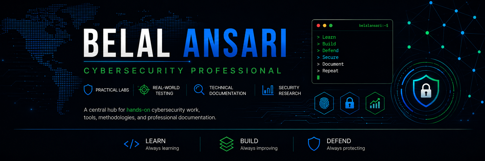
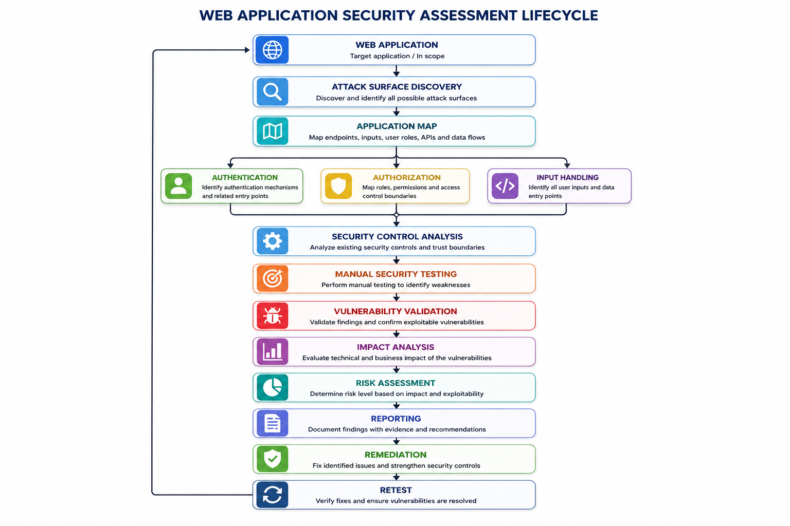

# 🛡️ Web Application Security

### Security Assessment • Vulnerability Research • Penetration Testing

<p align="center">
  
</p>

<p align="center">
  <strong>
    A practical security research and assessment portfolio focused on
    web application vulnerabilities, security controls, attack surface analysis,
    manual testing, vulnerability validation, impact assessment, and remediation.
  </strong>
</p>

<p align="center">

🔎 Reconnaissance
&nbsp; • &nbsp;
🗺️ Attack Surface Mapping
&nbsp; • &nbsp;
🧪 Manual Testing
&nbsp; • &nbsp;
💥 Vulnerability Validation
&nbsp; • &nbsp;
📊 Risk Analysis
&nbsp; • &nbsp;
📝 Security Reporting
&nbsp; • &nbsp;
🛡️ Remediation

</p>

---

## 🎯 Repository Overview

This repository represents a structured **Web Application Security assessment and
vulnerability research framework** built around the **OWASP Top 10**.

The objective is not simply to demonstrate individual vulnerabilities or
successful payloads.

The focus is on understanding:

- how an application works
- where trust boundaries exist
- how security controls are implemented
- how those controls can be tested
- how vulnerabilities can be reproduced
- how technical impact can be demonstrated
- how findings can be documented
- how remediation can be proposed
- and how fixes can be verified through retesting

The repository therefore follows a security assessment lifecycle rather than
a collection of disconnected vulnerability examples.

---

# 🧭 Security Assessment Lifecycle

<p align="center">
  
</p>

The assessment process follows a repeatable security workflow:

```text
Understand Application
        │
        ▼
Discover Attack Surface
        │
        ▼
Map Endpoints / Inputs / Roles / APIs
        │
        ▼
Identify Security Boundaries
        │
        ▼
Analyze Security Controls
        │
        ▼
Perform Manual Security Testing
        │
        ▼
Validate Vulnerability
        │
        ▼
Assess Technical & Business Impact
        │
        ▼
Document Evidence
        │
        ▼
Recommend Remediation
        │
        ▼
Retest
        │
        └───────────────► Security Feedback Loop